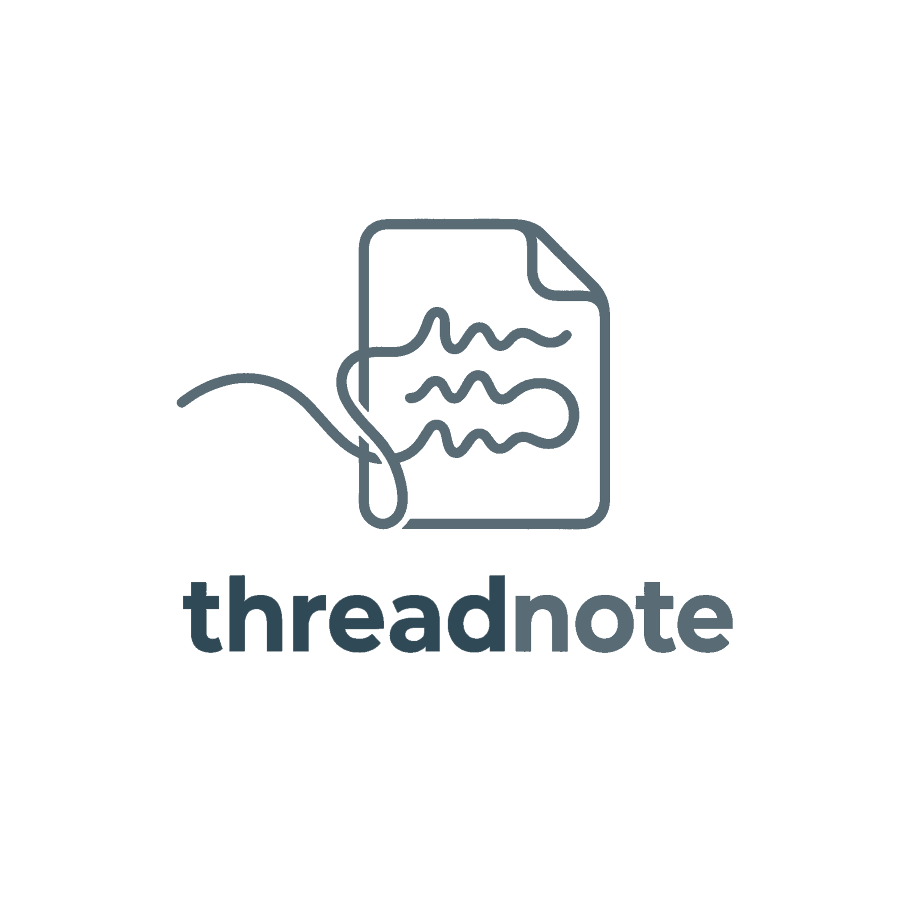

<p align="center">
  
</p>

# Threadnote

`threadnote` is a safe local workflow for using [OpenViking](https://openviking.ai/) as shared, agent-neutral context for development work.
It is intentionally scoped to curated docs, memories, skills, and handoffs. It is not a source-navigation replacement,
and it does not index whole repositories by default.

> **Walkthrough deck:** https://kashkovsky.github.io/threadnote/

## Real-World Uses

**Want to continue work in a fresh agent session?**  
`threadnote install` adds user-level Codex, Claude, Cursor, and Copilot instructions so new agents automatically recall recent handoffs and relevant memories before they start changing code.

**Working on a feature branch over several sessions?**
Agents recall the branch handoff for current status, then recall durable feature memories for the design, decisions,
interfaces, and gotchas behind the feature. As useful implementation knowledge appears, agents update the durable feature
memory instead of leaving everything buried in transient handoffs.

**Implemented a feature a while ago and need to pick it up again?**  
Ask the agent to recall the feature, branch, or repo. Threadnote returns auditable `viking://` pointers that the agent can read before deciding what still matters.

**Switching between Codex, Claude, Cursor, and Copilot?**\
Install the MCP adapter for each agent you use. The user-level instructions tell agents to store a handoff before they pause, so the next agent can search the same local memory layer instead of reconstructing context
from chat history.

**Working through a long task until the agent context window fills up?**  
After compaction, the next agent turn can recall the relevant Threadnote memories and handoffs instead of relying only on the compressed conversation summary.

**Found a durable workflow fact, like how a repo runs tests or where release notes live?**  
Ask the agent to remember it. Threadnote keeps that memory local and searchable without editing unrelated repo files.

**Have reusable agent workflows already installed as skills?**\
Run `threadnote seed-skills` to make local `SKILL.md` guidance discoverable through recall. Agents can find relevant testing, release, on-call, debugging, or plugin-provided workflows without you reopening the same skill files by hand.

**Recall returned several overlapping memories?**
Agents are instructed to compact them into one concise replacement memory and forget only the clearly redundant originals,
keeping future recall sharper without losing useful detail.

**Still working on the same issue?**
Use `threadnote remember --replace <uri>` or `threadnote handoff --replace <uri>` to keep one current-state memory fresh
instead of accumulating near-duplicate progress notes.

## Memory Lifecycle

Threadnote separates current durable knowledge from the historical handoff trail.

New `remember` records default to `kind: durable` and `status: active`. New `handoff` records use `kind: handoff` and
`status: active`. Add `--project` and `--topic` when the memory represents an ongoing issue or stable fact:

```bash
threadnote remember --project threadnote --topic install-health --text "Install/repair waits for OpenViking health."
threadnote handoff --project threadnote --topic lifecycle-storage --task "Implement lifecycle-aware memories"
```

Active memories with the same project/topic write to a stable lifecycle path, so later updates replace the current
version instead of creating another timestamped note. Untagged memories still use timestamped files when you want a
historical trail.

For feature branches, keep a durable feature memory and an active handoff side by side with the same project/topic:

```bash
threadnote remember --kind durable --project my-repo --topic feature-x --text "Feature knowledge: ..."
threadnote handoff --project my-repo --topic feature-x --task "Current status for feature X"
```

Agents should update the durable feature memory when valuable implementation knowledge changes, and update the handoff
when current status, tests, blockers, or next steps change.

Use `archive` when an old handoff is useful for provenance but should stop being treated as current working context:

```bash
threadnote archive viking://user/example/memories/handoffs/active/threadnote/lifecycle-storage.md
threadnote recall --query "threadnote lifecycle storage"
threadnote recall --query "threadnote lifecycle storage" --include-archived
```

If OpenViking is still processing the original file, `archive` keeps the archived copy and tells you to retry
`threadnote forget <uri>` later.

## Why Not Just CLAUDE.md Or AGENTS.md?

Use them. Threadnote is not a replacement for checked-in instructions.

`CLAUDE.md`, `AGENTS.md`, Cursor rules, and repo docs are the right place for stable, canonical guidance: coding
standards, test commands, review rules, architecture notes, and anything the whole team should version and discuss.

They are less ideal for living context: what happened in the last agent session, which branch was halfway through a
refactor, what an on-call investigation concluded, which workaround was verified on one machine, or which duplicate
memories should be compacted. Putting that history into instruction files makes them noisy, stale, and expensive to load
into every context window.

Threadnote keeps that moving layer local, searchable, and shared across agents. Agents recall only the relevant durable
feature memories, handoffs, and skill/resource pointers when they need them, while the source files stay authoritative
for project rules.

The split is simple: put durable repo policy in `CLAUDE.md`/`AGENTS.md`; put feature knowledge, task history, handoffs,
personal workflow facts, and local cross-agent memory in Threadnote.

## Safety Model

- Machine writes stay **locally** under `THREADNOTE_HOME`, which defaults to `~/.openviking`.
- Curated manifests only: seed commands import only paths listed in `config/seed-manifest.example.yaml` or an explicit
  per-developer manifest.
- Ignore rules: `.threadnoteignore` excludes build output, binary artifacts, local auth files, env files, and logs.
- Redaction: known config files such as `.mcp.json`, `config.toml`, and settings JSON are copied through a redactor
  before import.
- Secret scanning: candidate files are skipped if common token or private-key patterns remain after redaction.
- User instructions: `install` upserts managed Threadnote guidance in `~/.codex/AGENTS.md`, `~/.claude/CLAUDE.md`,
  `~/.cursor/rules/threadnote.md`, and `~/.copilot/instructions/threadnote.instructions.md` without replacing existing
  personal instructions.
- Agent config changes are explicit: `mcp-install` prints commands and snippets by default; use `--apply` to run them.

## Install

Install with one command:

```bash
curl -fsSL https://raw.githubusercontent.com/Kashkovsky/threadnote/main/scripts/install.sh | sh
```

This installs the published package from npmjs and runs `threadnote install`. The install command sets up local config,
repairs the OpenViking Python environment, and starts the local server so health problems surface immediately. It does
not use npm `postinstall`, because setup writes local machine config and should be an explicit action.

Confirm it is healthy:

```bash
threadnote doctor --dry-run
```

If install or health checks fail, see [Troubleshooting](docs/troubleshooting.md).

To force a runtime:

```bash
curl -fsSL https://raw.githubusercontent.com/Kashkovsky/threadnote/main/scripts/install.sh | THREADNOTE_RUNTIME=bun sh
curl -fsSL https://raw.githubusercontent.com/Kashkovsky/threadnote/main/scripts/install.sh | THREADNOTE_RUNTIME=deno sh
```

Or install manually:

```bash
npm install --global threadnote
threadnote install
threadnote doctor --dry-run
```

### Update

Threadnote occasionally checks npm for a newer published version when you run human-facing commands such as `doctor`,
`start`, `install`, or `repair`. The check is cached under `THREADNOTE_HOME` and never runs in CI or when
`THREADNOTE_NO_UPDATE_CHECK` or `NO_UPDATE_NOTIFIER` is set.

Update the package and refresh local shims, user instructions, and MCP config with one command:

```bash
threadnote update
```

Check without changing anything:

```bash
threadnote update --check
threadnote update --dry-run
```

After updating, restart Cursor, Copilot, Codex, Claude, or open a fresh agent session so MCP tools reload.

Some releases include post-update memory migrations. `threadnote update` runs the new package's migration prompt after
repair, explains what will change, and asks before applying it. Use `threadnote update --yes` for unattended local
migrations or `threadnote update --no-post-update` to skip them.

Applied migrations are tracked by id under `THREADNOTE_HOME`, and migration commands are written to be safe to rerun.

If you update from an older Threadnote version that only knew how to run `repair`, the new repair step will still detect
applicable migrations and print the manual command to run next.

### MCP

Make the agents you use aware of Threadnote. Use only the MCP install lines for agents you actually use. Open a fresh
agent session after installing MCP so the new server registration is loaded.

Dry-run examples:

```bash
threadnote mcp-install codex
threadnote mcp-install claude
threadnote mcp-install cursor
threadnote mcp-install copilot
```

Apply after review:

```bash
threadnote mcp-install codex --apply
threadnote mcp-install claude --apply
threadnote mcp-install cursor --apply
threadnote mcp-install copilot --apply
```

Claude installs at `user` scope by default so the same OpenViking MCP server is available from any repo or worktree.
Use `--scope local` or `--scope project` only when you intentionally want repo-scoped Claude MCP config.
Cursor installs by updating the global `~/.cursor/mcp.json` file.
Copilot installs by updating the VS Code user-profile `mcp.json` file. Set `THREADNOTE_COPILOT_MCP_CONFIG` if you use a
custom VS Code profile or want to test against a temporary file.

If the package or checkout that originally installed `threadnote` has moved, run repair:

```bash
threadnote repair
```

This rewrites the `threadnote` shim and reinstalls the stdio MCP adapter for available agents so launcher paths point
at the current checkout.

The default install uses the bundled stdio MCP adapter, because OpenViking `0.3.12` does not expose the native `/mcp`
HTTP route:

```bash
codex mcp add threadnote -- threadnote-mcp-server
claude mcp add threadnote -- threadnote-mcp-server
```

Cursor uses the equivalent entry in `~/.cursor/mcp.json`.
Copilot uses the VS Code MCP `servers` entry in the user-profile `mcp.json`.

### Agent hooks (optional, opt-in)

The instruction files (`~/.codex/AGENTS.md`, `~/.claude/CLAUDE.md`, etc.) are the **cross-agent guidance floor** — they
ask agents to recall context, store handoffs, and so on, and they work for every supported agent. They rely on the
agent to comply.

For deterministic moments where the agent shouldn't have to remember, Threadnote can also install agent-side
**hooks** — currently for Claude Code (the only supported agent that exposes a hook surface today):

- **`PreCompact`** auto-stores a handoff snapshot for the current repo right before Claude compacts the conversation,
  so the next turn can recall it even if the agent forgot to write a handoff manually.
- **`SessionStart`** preloads the latest threadnote handoff/feature memory for the current repo into the new session
  context, so the first turn already knows where you left off. The same hook also runs a daily-cached check against
  the npm registry and prints a one-line `[threadnote] vX.Y.Z available; run threadnote update` banner when the
  installed version is behind, so you stop missing releases. Set `THREADNOTE_AUTO_UPDATE=1` to skip the nag and have
  the hook spawn `threadnote update --yes` in the background instead — the new version takes effect on the next
  session.

Install them per agent (Codex / Cursor / Copilot are no-ops today — Threadnote prints a clear explanation):

```bash
threadnote install-hooks claude --dry-run   # preview the change
threadnote install-hooks claude --apply     # add managed entries to ~/.claude/settings.json
threadnote install-hooks claude --remove --apply  # take them out again
```

Or opt in at install time and let Threadnote drive every supported agent in one shot:

```bash
threadnote install --with-hooks
```

Managed entries are tagged with `"_threadnote": "managed"` so `threadnote repair` and `threadnote uninstall` can find
and rewrite/remove only those entries without touching any of your own hooks. Hooks complement, not replace, the
instruction files: the soft guidance covers semantic decisions ("is this memory durable?", "is this work meaningful
enough to publish?"); hooks cover deterministic moments the agent shouldn't be trusted to remember.

If a future OpenViking build exposes a healthy native endpoint, install it explicitly:

```bash
threadnote mcp-install claude --native-http --apply
```

### Seed Local Repos

Memories and handoffs work before seeding. Seed local repos when you want agents to recall repo guidance, docs, and
skills without reopening the same files by hand.

Create or update the local manifest with the repos you care about:

```bash
threadnote init-manifest --repo ~/src/my-service --repo ~/work/mobile-app
```

Review what will be imported, then seed curated repo guidance:

```bash
threadnote seed --dry-run
threadnote seed
```

For Git worktrees, seed the stable checkout by default:

```bash
threadnote init-manifest --repo ~/src/coda
```

You usually do not need to add every temporary worktree such as `~/src/worktrees/coda/my-branch`. Threadnote treats each
worktree path as its own manifest project today, so adding every worktree can duplicate seeded repo resources and make
recall noisier. Add a worktree only when it is long-lived or has branch-specific docs, instructions, or repo-local skills
that should be recalled separately.

Optionally seed shared and repo-local skills. This imports existing `SKILL.md` files as a searchable resource catalog so
agents can discover relevant workflow guidance; it does not install or activate skills in the agent runtime.

```bash
threadnote seed-skills --dry-run
threadnote seed-skills
```

When you add another local repo later, rerun `init-manifest --repo <path>` and seed again.

This is it! Start working with your agents as usual. The agent will automatically recall relevant memories and store the new ones. If you want to force it to recall/handoff something, just ask explicitly.

## Commands

- `doctor`: checks prerequisites, the generated command shim, manifest shape, templates, and local OpenViking health.
- `install`: installs `openviking[local-embed]==0.3.12` if missing, creates `~/.openviking` config files if absent,
  writes the command shim, upserts user-level agent instructions, and starts/checks OpenViking health by default. Use
  `--no-start` to skip the health check.
- `update`: updates the published Threadnote package, then runs `repair` so shims and MCP config point at the new
  version.
- `repair`: fixes install/config/shim/manifest/server health issues and rewrites Codex/Claude/Cursor/Copilot MCP configs
  from the current checkout.
- `start`: starts `openviking-server` on `127.0.0.1:1933`.
- `stop`: stops the detached server pid or macOS LaunchAgent.
- `uninstall`: removes Threadnote shims, MCP config, launchd config, and managed user instructions. Memories are
  preserved by default; pass `--erase-memories` to delete `THREADNOTE_HOME`.
- `init-manifest`: creates or updates `~/.openviking/seed-manifest.yaml` from one or more developer repo roots.
- `seed`: imports curated repo guidance and docs from the manifest.
- `seed-skills`: imports global and repo-local `SKILL.md` files as a searchable resource catalog so agents can discover
  reusable workflow guidance. Use `seed-skills --native` only after configuring a working VLM provider.
- `mcp-install codex|claude|cursor|copilot`: installs or prints OpenViking MCP configuration for Codex, Claude, Cursor,
  or GitHub Copilot in VS Code.
- `remember`: stores a durable memory. Use `--replace <uri>` to store an updated memory and remove a superseded one
  after the new memory succeeds. Use `--kind`, `--project`, and `--topic` to store lifecycle-aware current knowledge.
- `migrate-memories`: migrates legacy session-only `MEMORY` and `HANDOFF` records into durable memory files. Run
  `migrate-memories --dry-run` first; use `--all-accounts` when importing from older local OpenViking accounts.
- `migrate-lifecycle`: moves clear legacy handoff memories from the old events path into archived lifecycle handoff
  paths. It dry-runs by default; use `--apply` after reviewing the output.
- `recall`: searches shared OpenViking context. It infers repo or skill scope from queries like
  `skills for api service`; use `--uri` or `--no-infer-scope` to override. Exact durable-memory matches skip archived
  lifecycle paths unless `--include-archived` is passed.
- `read`: reads a `viking://` URI returned by `recall` or `list`.
- `list` / `ls`: lists a `viking://` directory.
- `handoff`: stores current git state and next-step notes as a durable handoff. Use `--replace <uri>` to update the
  current handoff for the same active issue, or `--project` and `--topic` to keep one active handoff file updated.
- `archive`: copies a memory into the archived lifecycle tree, then removes the original after the archive write
  succeeds.
- `forget`: removes a `viking://` URI.
- `export-pack` / `import-pack`: moves local context through `.ovpack` files.
- `share init|status|sync|publish|unpublish|list|remove`: opts a curated subset of durable memories into a team git
  repo. Threadnote periodically fetches configured share repos and automatically syncs clean incoming changes before
  agent recall/read; use `share sync` for dirty worktrees, conflicts, explicit pushes, or immediate manual sync.
  Personal handoffs and preferences stay local. See `docs/share.md` for the full workflow and the publish-time scrubber
  rules.

## Source Checkout

TypeScript sources live under `src/`; `src/threadnote.ts` is the CLI entrypoint and `src/mcp_server.ts` is the stdio MCP
adapter entrypoint.

For local development from this repo:

```bash
npm install
npm run build
npm run doctor -- --dry-run
npm run threadnote -- install
```

`install` writes a small command shim to `~/.local/bin/threadnote` by default and upserts user-level agent guidance in
`~/.codex/AGENTS.md`, `~/.claude/CLAUDE.md`, `~/.cursor/rules/threadnote.md`, and
`~/.copilot/instructions/threadnote.instructions.md`. After that, use the short command from any repo or working
directory:

```bash
threadnote doctor --dry-run
threadnote init-manifest --repo ~/src/my-service --repo ~/work/mobile-app
threadnote seed --dry-run
threadnote seed-skills --dry-run
```

If `~/.local/bin` is not on your `PATH`, either add it or set `THREADNOTE_BIN_DIR` before running `install`.
After reviewing dry-run output, remove `--dry-run` for the operation you want to perform.

The bundled `config/seed-manifest.example.yaml` is only an example. Each developer should create a local manifest at
`~/.openviking/seed-manifest.yaml` with `threadnote init-manifest`; repo paths can be anywhere.

## Configuration

Environment variables:

- `THREADNOTE_HOME`: local state directory, default `~/.openviking`.
- `THREADNOTE_MANIFEST`: seed manifest path. Defaults to `~/.openviking/seed-manifest.yaml` if present, otherwise
  the bundled example manifest.
- `THREADNOTE_ACCOUNT`: OpenViking account header/config value, default `local`.
- `THREADNOTE_USER`: OpenViking user value, default local username.
- `THREADNOTE_AGENT_ID`: shared agent identity, default `threadnote`.
- `THREADNOTE_OPENVIKING_VERSION`: package version to install, default `0.3.12`.
- `THREADNOTE_NPM_REGISTRY`: npm registry used by the installer and updater, default `https://registry.npmjs.org/`.
- `THREADNOTE_NO_UPDATE_CHECK`: disables opportunistic update notifications.
- `THREADNOTE_BIN_DIR`: directory for the `threadnote` shim, default `~/.local/bin`.
- `THREADNOTE_COPILOT_MCP_CONFIG`: explicit VS Code/Copilot `mcp.json` path for `mcp-install copilot`.
- `THREADNOTE_HOST`: local bind host, default `127.0.0.1`.
- `THREADNOTE_PORT`: local bind port, default `1933`.

Local projects using `localhost:80` or `localhost:443` do not conflict with OpenViking on `127.0.0.1:1933`. A conflict
only occurs when another process already owns the same host and port. If that happens, choose a different
`THREADNOTE_PORT`.

## Misc

See `docs/migration.md` for switching an existing repo workflow to `threadnote` without deleting canonical
`AGENTS.md`, `CLAUDE.md`, `.claude/`, or `.agents/` files.

See `docs/agent-instructions.md` for the user-level agent guidance installed by `threadnote install`.

## Recall And Read

Recall is a search step. It returns candidate `viking://` URIs plus abstracts. Agents should then read or list the
selected URI:

```bash
threadnote recall --query "agent context"
threadnote read viking://agent/threadnote/memories/.abstract.md
threadnote list viking://agent/threadnote/memories --all --recursive
```

When MCP is installed, the agent should use Threadnote MCP `recall_context`, then `read_context` or `list_context`.
Agents must pass JSON arguments, for example `recall_context({"query":"agent context"})`. Older adapters expose
`search`, `read`, and `list` aliases. Before recall/read returns, Threadnote automatically syncs clean incoming shared
memory updates when a configured share repo is behind; failures are reported as warnings and the local read still
continues. The CLI commands are the fallback path.
