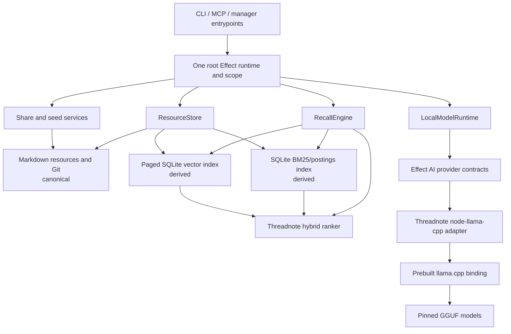

# Threadnote 4.0: self-contained storage and local AI

Status: implementation complete through Phase 7; beta rollout active
Target: Threadnote 4.0.0
Working branch: `codex/4.0.0`
Last updated: 2026-07-30

The implemented runtime contract is documented in [architecture.md](architecture.md). The phase sections below retain
the delivery plan and acceptance history; they are not an alternative description of the current product. The
[performance and reliability audit](4.0-performance-reliability-audit.md) records the release-scale measurements and
remaining boundaries.

## Implementation snapshot

Phases 0 through 7 are implemented on the release branch. The frozen 3.0.3 recall and performance baselines, recall-v2
corpus, quality gates, and first real-model candidate results are checked in. Canonical storage, derived search,
migration, sharing, MCP, manager, model management, and local inference now run inside the standalone Threadnote
process and use
`~/.threadnote`.

The measured BGE Small embedding candidate now passes every category and safety gate after calibrating the
semantic-only no-answer boundary and fixing overlapping lexical/semantic graph seeds. It is installed and selected as
the core embedding model. The measured Jina reranker still regresses no-answer recall to zero and remains unselected.
Both summaries are retained under `test/evaluation/candidates/threadnote-4.0.0/`. Phase 8 remains the beta,
release-candidate, and stable rollout process and must not waive the checked gates.

## Outcome

Threadnote 4.0 removes OpenViking and Python from the installed product. A normal install, upgrade, recall, memory
write, share operation, manager session, and local-AI operation must not require `python`, `uv`, `pip`, a Python
virtual environment, or an OpenViking server.

The replacement is intentionally smaller than OpenViking:

- Markdown files and Git remain the canonical, inspectable data store.
- Threadnote owns URI resolution, atomic storage, seeding, migration, and derived indexes.
- Threadnote's existing lexical and hybrid ranker remain the retrieval authority.
- `node-llama-cpp` provides in-process GGUF inference for embeddings, reranking, and optional structured generation.
- Effect owns configuration, resource lifetime, concurrency, cancellation, typed errors, observability, and test
  substitution.
- Search indexes and embeddings remain derived, versioned, disposable data.

The project will not replace OpenViking with another memory platform, vector server, Python service, or canonical
database.

## Release success criteria

Threadnote 4.0 is ready only when all of these are true:

1. A clean npm installation succeeds on supported platforms without invoking Python or compiling native code.
2. `threadnote install` provisions the pinned core embedding model without requiring a separate user action.
3. Once the core GGUF model is installed, lexical and semantic recall work with the network disabled; deterministic
   lexical recall remains the fail-open path if native inference is temporarily unavailable.
4. No production path starts or contacts OpenViking or the Python local-AI server.
5. Upgrading an existing 3.x `~/.openviking` home into `~/.threadnote` preserves every canonical file, memory URI,
   relationship, share mapping, and lifecycle state, with a tested rollback path.
6. Retrieval quality is non-inferior to the frozen 3.x/OpenViking baseline by category, not merely by a blended score.
7. Security invariants have zero tolerated regressions: no path traversal, scope leakage, stale/superseded leakage,
   secret transmission, silent data loss, or unsafe PID/process handling.
8. Recall and index performance stay inside budgets measured on supported platform classes at 10,000 documents.
   A 100,000-document suite establishes the next scaling boundary.
9. The published tarball, npm dependency graph, third-party notices, model manifests, install/repair/uninstall flows,
   documentation, and manager UI all describe the same runtime.
10. The legacy OpenViking and Python code, tests, configuration, launch records, CI setup, and bundled Python script
    are deleted rather than left as hidden fallback paths.

## Decisions

### Canonical storage

The default Threadnote-owned home is `~/.threadnote`. An explicit `THREADNOTE_HOME` or `--home` override may relocate
it for testing or managed environments, but no 4.0 production workflow may continue writing Threadnote-owned state
under `~/.openviking` after migration.

Markdown and other seeded text resources remain canonical files under `~/.threadnote`. The same root owns
configuration, derived indexes, model files, locks, migration receipts, logs, and local operational state; the exact
subdirectory layout is specified by an ADR and versioned independently. Git remains the shared memory transport. No
SQLite or vector database becomes authoritative.

The derived search store uses:

- a normalized SQLite postings/BM25 index through `@effect/sql-sqlite-node` and Node's built-in SQLite runtime;
- transactional incremental updates and query-term-only reads;
- paged, content-addressed Float32 vectors in SQLite;
- exact cosine similarity over normalized vectors.

At 384 dimensions, 10,000 float32 vectors require about 15.36 MB. An approximate nearest-neighbor index is therefore
not a 4.0 prerequisite. A vector extension may be adopted later only if production-shaped benchmarks show a concrete
concurrency, cold-start, update, or scale problem.

### External URI compatibility

Storage internals will use a parsed `ResourceId`; they will not manipulate URI strings as paths.

Threadnote 4.0 emits `threadnote://` identifiers exclusively. The parser accepts the 3.x scheme as a legacy input alias
and immediately canonicalizes it, so existing manifests and stored relation headers remain readable without leaking the
retired name into new output. Canonical bytes live under `~/.threadnote/data/<account>`; the beta.1
`data/viking/<account>` directory is a migration source only.

### Local inference engine

`node-llama-cpp` is the selected local inference engine. It has prebuilt macOS, Linux, and Windows packages, supports
embeddings and reranking, exposes abort signals, and does not require `node-gyp` or Python. It can still fall back to
CMake when no compatible binary exists, so Threadnote will explicitly call `getLlama` with:

```ts
{
  build: "never",
  skipDownload: true
}
```

The default product must fail with a clear `UnsupportedNativeRuntime` diagnostic rather than compiling native code on
the user's machine. A source build may be offered later as an explicit developer-only command; it must never be an
automatic install, startup, repair, or recall action.

Relevant upstream contracts:

- [`node-llama-cpp` embeddings and reranking](https://node-llama-cpp.withcat.ai/guide/embedding)
- [`node-llama-cpp` object lifecycle](https://node-llama-cpp.withcat.ai/guide/objects-lifecycle)
- [`getLlama` build policy](https://node-llama-cpp.withcat.ai/api/type-aliases/LlamaOptions)
- [interruptible model downloads](https://node-llama-cpp.withcat.ai/api/classes/ModelDownloader)

### What Effect replaces

Effect does not replace `llama.cpp`; it replaces the handwritten lifecycle and orchestration harness around it.

The 4.0 implementation will use:

- `effect` and `@effect/platform-node` for typed effects, platform services, scopes, concurrency, retries, logging,
  tracing, metrics, configuration, clocks, and entrypoint lifetime;
- `effect/unstable/ai/EmbeddingModel` as the provider-neutral embedding contract;
- `effect/unstable/ai/LanguageModel` where its structured-generation contract fits;
- `@effect/vitest` for scoped tests, deterministic clocks, service substitution, and typed failure assertions;
- a Threadnote-owned adapter around `node-llama-cpp`.

Effect's embedding service already supports single and ordered batch embedding, typed `AiError` failures, and request
batching. The adapter should reuse that contract instead of inventing another batching framework. See the upstream
[`EmbeddingModel` implementation](https://github.com/Effect-TS/effect/blob/main/packages/effect/src/unstable/ai/EmbeddingModel.ts).

Effect AI is still an unstable API, and using it is an accepted 4.0 tradeoff. Threadnote 4.0 does not need to wait for
those services to become stable. All Effect packages will be pinned to the same exact version, and imports from
`effect/unstable/ai` and `node-llama-cpp` must be restricted to `src/effect/ai/` adapters. Recall, memory, sharing,
manager, and CLI domain code will depend on Threadnote-owned services so a later stable-API migration, Effect beta
upgrade, or native-engine upgrade cannot spread through the codebase.

No production service may create a hidden runtime. Each executable gets one root Effect runtime and one root scope:

- short-lived CLI commands acquire and release resources in their command scope;
- the MCP server and manager retain warm scoped resources for their process lifetime;
- tests replace Layers rather than monkey-patching modules or starting localhost servers.

`ManagedRuntime` is not needed inside domain services. If a non-Effect external callback absolutely requires a Promise
bridge, a single entrypoint-owned bridge may be used and guarded by the existing architecture tests.

### Model roles

The model catalog will distinguish roles rather than treating every GGUF file as a chat model:

- `embedding`: core retrieval capability, automatically provisioned by install and repair;
- `reranker`: optional cross-encoder refinement of a bounded shortlist;
- `generation`: optional query expansion, enrichment, consolidation, and other structured generation.

Each model manifest records:

- stable Threadnote model ID and role;
- repository, file, immutable revision, SHA-256, byte size, and license;
- architecture, quantization, context limit, dimensions, normalization, and prompt prefixes;
- minimum RAM/VRAM class and supported runtime version;
- chunker and task compatibility;
- replacement/migration rules.

Phase 0 selected BGE Small Q8 as the core embedding model from measured candidates. No reranker passed the safety gate.
The current Gemma generation model remains a compatibility candidate, not an automatic 4.6 GB dependency of semantic
recall.

## Target architecture



## Effect service design

The exact names may change during implementation, but the boundaries may not collapse.

### Storage and indexing

- `ResourceStore`
  - parse/resolve identifiers;
  - read, stat, list, glob, grep, create, compare-and-replace, remove, and make directories;
  - atomic writes and safe traversal rules;
  - no search-index behavior.
- `SeedStore`
  - manifest discovery, ignore rules, secret scan, fingerprints, curated copies, and source validation.
- `RecallIndex`
  - incremental lexical and vector index lifecycle;
  - rebuild, validation, corruption recovery, version switching, and index statistics.
- `VectorSearch`
  - normalized exact scan and deterministic top-k;
  - no model loading.

### Local AI

- `LlamaCppEngine`
  - the only service that imports `node-llama-cpp`;
  - one scoped `Llama` instance per process;
  - typed wrappers for model, embedding context, ranking context, generation context, and download operations;
  - interruption forwarding and native error translation.
- `LocalModelCatalog`
  - role-aware manifests, compatibility checks, licenses, paths, and selected defaults.
- `LocalModelStore`
  - resumable download, temporary files, checksums, free-space checks, atomic promotion, and safe deletion.
- `LocalModelRegistry`
  - scoped model-handle sharing;
  - bounded context acquisition;
  - idle unloading where it measurably helps;
  - no global mutable singleton.
- `EmbeddingModel`
  - implemented with Effect AI's provider-neutral constructor over `LlamaCppEngine`;
  - batched indexing and single-query embedding.
- `Reranker`
  - Threadnote-owned service because Effect AI has no stable provider-neutral reranking contract.
- `StructuredGenerator`
  - Threadnote-owned domain port used by enrichment, expansion, selection, and consolidation;
  - may be implemented through Effect `LanguageModel` where the adapter is complete;
  - JSON-schema grammar plus post-generation Effect Schema validation.

### Native resource lifetime

Every `Llama`, model, and context allocation must be acquired through `Layer.scoped` or `Effect.acquireRelease`.
Finalizers explicitly call `.dispose()`; garbage collection is not a resource-management strategy.

The layer must:

- share one `Llama` instance for the process;
- dispose contexts before models and models before the `Llama` instance;
- forward Effect interruption to `AbortSignal`;
- cap concurrent evaluations and model loads;
- prevent use-after-dispose;
- reject unsafe memory configurations rather than disabling upstream safety checks;
- surface load time, inference time, token counts, model identity, backend, RAM/VRAM estimates, and disposal failures as
  structured telemetry.

### Error model

Native or model failures must not become untyped `Error` values at domain boundaries. At minimum:

- `NativeRuntimeUnavailable`
- `UnsupportedNativeRuntime`
- `ModelNotInstalled`
- `ModelManifestInvalid`
- `ModelChecksumMismatch`
- `ModelDownloadFailed`
- `ModelLoadFailed`
- `InsufficientMemory`
- `EmbeddingFailed`
- `RerankingFailed`
- `GenerationFailed`
- `InvalidModelOutput`
- `InferenceInterrupted`

Recall continues to fail open to lexical results for model absence, timeout, interruption, or inference failure.
Canonical writes must never depend on optional enrichment succeeding.

## Phase 0: measurement before behavior changes

Phase 0 is a release gate, not a disposable spike. It must land before native storage or inference changes so the
existing 3.x/OpenViking system can produce a frozen comparison baseline.

### 0.1 Evaluation contract v2

Replace the small recall-v1 fixture as the primary quality gate. It currently contains 10 documents, 8 queries, and
precomputed semantic scores; it tests ranker behavior but does not execute a real embedding pipeline.

Create a versioned evaluation package with:

- at least 200 reviewed canonical documents and 250 reviewed queries;
- relevance grades from 0 through 3 rather than one expected URI;
- explicit forbidden results and expected no-answer cases;
- corpus/query provenance, schema version, category, language, project, timestamp, and expected retrieval stage;
- deterministic distractor generation to 1,000, 10,000, and 100,000 documents;
- no copied user memories, secrets, customer data, or dependency on a developer home directory;
- stable fixture hashes and a schema migration utility.

Required query categories:

| Category          | Required coverage                                                                             |
| ----------------- | --------------------------------------------------------------------------------------------- |
| Exact and lexical | rare identifiers, file names, symbols, error codes, phrases, prefixes, typos                  |
| Semantic          | paraphrases, synonyms, indirect descriptions, vocabulary mismatch                             |
| Code and docs     | API contracts, commands, code tokens, prose-to-code and code-to-prose                         |
| Scope             | current project, workset, another project, global guidance, ambiguous project names           |
| Lifecycle         | active, archived, superseded, historical, replaced, expired                                   |
| Authority         | checked-in guidance, shared durable memory, personal memory, handoff, generated distractor    |
| Time              | current status, prior state, future validity, stale handoff                                   |
| Graph             | related, blocked-by, supersedes, depends-on, unrelated high-semantic distractor               |
| No answer         | absent concepts, weak near-matches, misleading vocabulary, contradictory evidence             |
| Adversarial       | prompt injection text, secret-like text, malformed metadata, huge fields, Unicode confusables |
| Chunking          | headings, long documents, repeated sections, exact boundary hits, duplicate chunks            |
| Multilingual      | a separately scored set for each language Threadnote claims to support                        |

### 0.2 Recall quality metrics

Record aggregate and per-category metrics:

- Recall@1, Recall@5, and Recall@10;
- mean reciprocal rank;
- nDCG@5 and nDCG@10;
- no-answer precision, recall, and F1;
- stale-hit rate;
- forbidden/scope-leak rate;
- authority-inversion rate;
- explanation-reason contract coverage;
- semantic uplift over lexical-only retrieval;
- reranker uplift over hybrid retrieval;
- average candidates read and context bytes/tokens returned;
- model expansion invocation and fallback rates.

Security and compatibility metrics use a zero-regression threshold. Quality gates use a frozen 3.x baseline and
explicit non-inferiority margins per category. A strong overall score cannot hide a regression in no-answer, lifecycle,
scope, code, or multilingual behavior.

### 0.3 Performance suites

Separate correctness tests from performance measurements.

Microbenchmarks:

- tokenization and BM25 lookup;
- vector normalization, serialization, decode, exact scan, and top-k;
- chunk fingerprinting and incremental index updates;
- URI parsing and path resolution;
- metadata parsing and atomic record encoding.

End-to-end benchmarks:

- empty, 1,000, 10,000, and 100,000-document index builds;
- one-document and 1%, 10%, and full index updates;
- hot lexical, hot vector, hybrid, and complete recall;
- cold index decode and corruption rebuild;
- first embedding model load, warm query embedding, and batch document embedding;
- reranker and structured-generation cold/warm paths;
- concurrent readers, one writer plus readers, and competing process behavior;
- migration of representative 3.x homes and shares;
- CLI startup, MCP startup, manager startup, shutdown, and resource disposal.

Record p50, p95, p99, throughput, peak RSS, native/external memory, estimated VRAM, CPU time, event-loop delay, disk
bytes, model/index load time, package install time, and tarball/dependency size. Store raw JSON with:

- commit and dirty state;
- Node, npm, OS, architecture, CPU, RAM, backend, and model manifest;
- warmup/sample counts and fixture hashes;
- benchmark schema and runner versions.

Use `@effect/vitest` and Vitest for contracts, fault injection, deterministic time, and service-layer tests. Use a
dedicated benchmark runner for performance. Vitest's benchmark feature is still experimental and its module runner can
distort imported microbenchmarks, so Phase 0 should use `mitata` or an equivalent stable runner against built artifacts
and retain a small explicit end-to-end orchestrator. See [Vitest's benchmark caveats](https://main.vitest.dev/guide/benchmarking).

Shared-host CI is suitable for correctness and gross performance smoke gates, not tight latency regression
thresholds. Nightly or release-candidate runs use pinned runner classes:

- Linux x64 CPU;
- macOS arm64 Metal;
- Windows x64 CPU;
- an additional Linux arm64 or macOS x64 install/runtime smoke path when infrastructure permits.

### 0.4 Reliability, recovery, and security suites

Add deterministic fault tests for:

- interruption during model download, model load, embedding, generation, indexing, migration, and atomic write;
- truncated or corrupted canonical files, manifests, indexes, vectors, and model files;
- disk full, read-only directory, permission denial, missing home, and invalid path encoding;
- symlink escape, traversal, case-fold collisions, Unicode normalization, and Windows reserved paths;
- stale locks, live lock owners, concurrent readers/writers, process crash, and orphan temporary files;
- model revision/dimension changes, mixed embedding spaces, interrupted rebuild, and rollback;
- missing or incompatible native prebuilt, CPU-only fallback, GPU initialization failure, and insufficient memory;
- offline install/recall, proxy/certificate failures, rate-limited downloads, and resumed downloads;
- malicious resource content attempting prompt injection or schema escape;
- secret scanner blocking before any remote provider or local index receives disallowed text.

Use property-based tests for `ResourceId`, path containment, atomic state transitions, index round trips, and migration
idempotence.

### 0.5 Frozen 3.x baseline

Before implementation changes:

1. Pin the current Threadnote, OpenViking, fixture, and optional local-generation model revisions.
2. Run lexical, OpenViking semantic, hybrid, expansion, selection, enrichment, sharing, migration-shaped, and
   distribution tests.
3. Capture quality, latency, memory, disk, package, and failure-mode artifacts.
4. Review unexpected results and label them as intended behavior or known defects.
5. Check in only compact, non-machine-specific baseline summaries and fixture metadata; retain raw CI artifacts
   separately.
6. Keep the legacy comparison job isolated so ordinary 4.0 development no longer requires Python after the baseline is
   frozen.

### Phase 0 exit criteria

- Evaluation v2 and generated-scale fixtures exist and are documented.
- Every metric has a definition, category breakdown, threshold policy, and JSON schema.
- Baseline artifacts can be reproduced from a clean checkout.
- Current 3.x behavior and known defects are frozen before replacement code lands.
- The embedding and reranking model bake-off produces an ADR selecting model(s), chunking, prefixes, normalization,
  dimensions, quantization, and hardware budgets.
- PR correctness gates and scheduled performance jobs are active.

## Phase 1: architecture seams

Introduce contracts while the current implementation still runs:

1. Add `ResourceId`, `ResourceStore`, `SeedStore`, `RecallIndex`, `VectorSearch`, `LocalModelCatalog`,
   `LocalModelStore`, `LlamaCppEngine`, `Reranker`, and `StructuredGenerator`.
2. Move OpenViking and the Python HTTP provider behind legacy adapter Layers.
3. Make CLI, MCP, manager, sharing, seeding, memory, and recall depend on the new domain services.
4. Centralize home-directory and storage-layout configuration.
5. Expand architecture tests to forbid direct OV CLI, HTTP endpoint, Python process, raw filesystem, and native-addon
   access outside approved adapters.
6. Add shadow-read and shadow-index comparison hooks that cannot mutate canonical data.

Exit criteria:

- No domain workflow imports or shells out to OV directly.
- Existing behavior and Phase 0 metrics remain unchanged.
- Test Layers can run every domain workflow without a real OV server or native model.

## Phase 2: native canonical store

Implement the filesystem store under `~/.threadnote`:

1. Specify the `~/.threadnote` directory layout and format versions.
2. Map parsed resource IDs to validated paths; reject traversal, absolute components, symlink escape, and unsafe
   platform names.
3. Implement atomic create, compare-and-replace, remove, mkdir, stat, read, list, glob, and grep.
4. Use temporary files, file and directory synchronization where supported, atomic rename, per-resource locks, and
   compare-and-swap fingerprints.
5. Preserve frontmatter, unknown fields, line endings where required, and existing memory URI identity.
6. Replace OV seed ingestion with curated copy, ignore rules, secret scanning, content fingerprints, source authority,
   deletions, and rename detection.
7. Replace OV-backed share reads/writes/reindex operations while retaining Git locking and conflict behavior.
8. Add recovery tooling for interrupted writes and orphan temporary files.

During this phase, native storage runs in shadow mode first, then supports an explicitly enabled lexical-only mode.

Exit criteria:

- Every storage, seed, share, and concurrency contract passes on Linux, macOS, and Windows.
- Shadow comparison finds no unexplained canonical-data divergence.
- A fresh home can run the complete non-AI product without OV.

## Phase 3: derived search and embeddings

1. Define document and chunk identity, heading context, maximum lengths, overlap, normalization, and versioning.
2. Make current lexical indexing independent of the OV directory layout.
3. Add the role-aware model catalog and safe, resumable model store.
4. Add the scoped `node-llama-cpp` engine with prebuilt-only policy.
5. Implement Effect AI's provider-neutral embedding service over the native engine.
6. Batch and resume document indexing; make query-time embedding independent of indexing progress.
7. Write content-addressed vectors and lightweight chunk mappings to versioned SQLite, updating active mappings only
   after all values are ready.
8. Add exact normalized cosine scan and deterministic top-k ordering.
9. Feed semantic scores into the existing explainable hybrid ranker.
10. Serve lexical results while vectors are unavailable, stale, rebuilding, interrupted, or incompatible.
11. Add status, progress, inspect, rebuild, verify, and purge-derived-data commands.

Database decision:

- use normalized SQLite for lexical postings because production homes demonstrated that the single JSON cache could
  reach hundreds of megabytes and made every refresh and query pay whole-file costs;
- keep vectors in paged SQLite rows while measured exact-scan behavior meets budgets;
- prototype an embedded approximate vector index only when the same benchmark contract demonstrates a need.

Exit criteria:

- Semantic quality meets Phase 0 non-inferiority gates.
- No query mixes vectors from different models, dimensions, normalizations, or chunker versions.
- Interrupted rebuilds leave the previous generation usable.
- Model absence and native runtime failure preserve deterministic lexical recall.

## Phase 4: reranking and structured generation

1. Implement a bounded native reranker service and compare it against the existing LLM selector.
2. Implement `StructuredGenerator` over node-llama-cpp with JSON-schema grammar and Effect Schema validation.
3. Migrate query expansion, candidate selection, memory enrichment, and consolidation.
4. Preserve current privacy rules: remote providers never receive local candidate excerpts unless explicitly allowed;
   local inference remains local.
5. Add deterministic seeds where supported, hard token/context budgets, bounded concurrency, timeouts, interruption,
   and fail-open behavior.
6. Decide from Phase 0 evidence whether recall needs generation at all when embeddings and reranking are available.
7. Remove the localhost token, port, PID, health server, Python environment lookup, and Python adapter lifecycle.
8. Replace `local-ai start/stop` semantics with model/runtime status, preload, unload, verify, install, switch, and
   remove operations. Preserve deprecated commands temporarily with precise migration output when useful.

Exit criteria:

- No shipped feature imports or executes Python.
- Native inference resources are released under success, failure, timeout, and process shutdown.
- Quality and safety gates pass with generation enabled, disabled, unavailable, and interrupted.

## Phase 5: product and compatibility migration

Migrate all remaining OpenViking-shaped surfaces:

- CLI commands and output;
- default and full MCP toolsets;
- manager APIs and UI;
- seed manifests and worksets;
- personal and shared memory CRUD;
- relationships, feedback, review candidates, and consolidation;
- share publish, clone, sync, mapping, conflict, and repair;
- doctor, status, start, stop, update, repair, uninstall, and diagnostics;
- package scripts, config templates, launch configuration, docs, examples, and agent instructions.

Raw OV parity tools require an explicit decision:

- reimplement only generic capabilities that belong in Threadnote, such as read/list/search/glob/grep;
- rename them under Threadnote contracts when compatibility permits;
- deprecate OV-specific watch, parser, code-outline, code-expand, session-store, or compression behavior rather than
  recreating unused platform features.

Exit criteria:

- Every supported public command/tool has a 4.0 contract test and migration note.
- The default toolset and manager contain no hidden legacy dependency.
- Unsupported parity features fail with an actionable deprecation, never a missing OV binary error.

## Phase 6: data migration and cutover

Provide an idempotent `threadnote migrate` flow:

1. Inventory the legacy `~/.openviking` home without starting OV.
2. Preflight free space, permissions, format compatibility, model files, shares, locks, and conflicts.
3. Copy canonical data into a staging sibling of `~/.threadnote`; never construct the new home inside
   `~/.openviking`.
4. Validate file counts, hashes, metadata, relationships, references, and share mappings.
5. Build derived indexes from canonical files.
6. Atomically promote the validated staging home to `~/.threadnote`.
7. Record a versioned migration receipt and preserve the old home read-only.
8. Support repeated dry-runs, interrupted resume, already-migrated detection, and verified rollback.
9. Never delete `~/.openviking` automatically. Offer a separately confirmed cleanup only after a successful cutover and
   backup window.

Run shadow recall on representative migrated homes and compare ranked results with the frozen baseline. Migration logs
must not copy memory bodies, secrets, or customer data into CI artifacts or diagnostics.

Exit criteria:

- Migration is idempotent and crash-safe at every injected failure point.
- Rollback restores 3.x operation without reversing or corrupting canonical data.
- Existing `threadnote://` references resolve identically after cutover.

## Phase 7: platform, security, and distribution hardening

1. Move runtime packages to the correct dependency class and externalize native modules from esbuild.
2. Pin `node-llama-cpp` and Effect packages exactly; upgrade them only through compatibility PRs.
3. Test npm global install, local install, `npx`, tarball install, update, repair, and uninstall.
4. Assert install and runtime paths do not invoke Python and do not silently compile llama.cpp.
5. Verify native prebuilt selection and CPU fallback on the supported platform matrix.
6. Add package-size, binary-load, model-license, checksum, SBOM/provenance, and third-party-notice gates.
7. Threat-model resource paths, model supply chain, prompt injection, native crashes, memory exhaustion, migration,
   sharing, and remote-provider opt-in.
8. Fuzz parsers and migration formats and run long-lived MCP/manager soak tests.
9. Add explicit diagnostics for native backend, model identity, index generation, memory estimate, and degraded lexical
   mode without leaking local paths unnecessarily.
10. Delete OV/Python production and CI code and prove absence with repository/package scans.

Exit criteria:

- Clean-install E2E passes on Linux, macOS, and Windows with Python absent from `PATH`.
- Published-tarball E2E passes, not only source-checkout tests.
- Security review and license review are complete.
- The legacy-dependency absence scans pass against source, built output, tarball, workflows, and docs.

## Phase 8: beta, release candidate, and stable rollout

1. Publish 4.0 betas with migration dry-run as the default recommendation.
2. Collect opt-in diagnostics limited to versions, timings, counts, and typed failures; never collect memory content.
3. Run full baseline comparisons for each release candidate.
4. Maintain a known-hardware/model result matrix and document degraded modes.
5. Freeze formats before RC1. After RC1, format changes require migration tests from every beta format.
6. Publish stable only after at least one successful beta migration and sustained MCP/manager soak run on each primary
   platform class.
7. Keep 3.x security fixes available during the migration window.

## Cross-cutting test strategy

### Unit and property tests

- Pure parsing, ranking, path, chunking, serialization, metric, and migration state-machine tests.
- Effect service tests using deterministic Layers and `@effect/vitest`.
- Property tests for identifiers, path containment, index round trips, normalization, and migration idempotence.

### Contract tests

- Run each domain contract against fake, legacy, and native adapters where applicable.
- Native adapter contract tests use a fake `LlamaCppEngine`; they do not require a model.
- A small real-GGUF smoke suite validates native integration separately.

### Integration tests

- Temporary homes and repositories only.
- Real atomic filesystem behavior, locks, index generations, migrations, and Git shares.
- Explicit interruption and process-boundary tests.

### End-to-end tests

- Built tarball and CommonJS launchers.
- CLI, stdio MCP, manager, upgrade, repair, migration, uninstall, and offline operation.
- Separate model-enabled jobs with immutable cached GGUF files and verified checksums.

### Release gates

Every pull request:

- lint, formatting, typecheck, build, unit/property/contract/integration tests;
- compact recall-quality suite;
- no-Python/no-OV architecture scans;
- Linux native-runtime smoke when relevant.

Scheduled and release candidate:

- full recall-quality and model bake-off suites;
- 10k/100k performance and soak suites;
- Linux, macOS, and Windows tarball E2E;
- migration corpus and rollback;
- security fuzzing and dependency/license review.

## Work that must not be hidden in cleanup

The following are first-class deliverables, not post-release polish:

- model license and checksum management;
- offline and proxy behavior;
- download resume and disk-space preflight;
- native runtime compatibility diagnostics;
- cancellation and resource disposal;
- corrupt index/model recovery;
- migration rollback;
- URI compatibility;
- concurrent process behavior;
- manager and MCP parity;
- package and installer validation;
- deletion of legacy code and documentation;
- measurable quality, performance, and security release gates.

## Initial ADR queue

Phase 0 and Phase 1 should produce reviewed ADRs for:

1. canonical `~/.threadnote` home and storage layout;
2. `ResourceId` grammar and `threadnote://` compatibility;
3. atomic write, lock, and compare-and-swap semantics;
4. chunk identity and index generation format;
5. SQLite lexical/vector schemas and approximate-index replacement criteria;
6. embedding model, dimensions, prefixes, quantization, and license;
7. reranker use and shortlist size;
8. generation model and structured-output adapter;
9. Effect AI isolation and native resource Layer;
10. prebuilt-only native runtime and supported platform matrix;
11. migration, rollback, and legacy-home retention;
12. public MCP/CLI parity and deprecations;
13. benchmark schemas, platform classes, thresholds, and baseline governance.

## Immediate next work

The remaining release work is Phase 8:

1. run the complete correctness, recall-quality, package, migration, Windows, and performance suites;
2. exercise the packed npm artifact on Linux, macOS, and Windows with automatic model provisioning;
3. verify upgrade preservation for canonical data, shares, instructions, selected models, and both derived indexes;
4. publish another beta only after those release-package checks pass;
5. collect beta feedback, cut a release candidate, rerun the same gates, and promote without weakening them.
