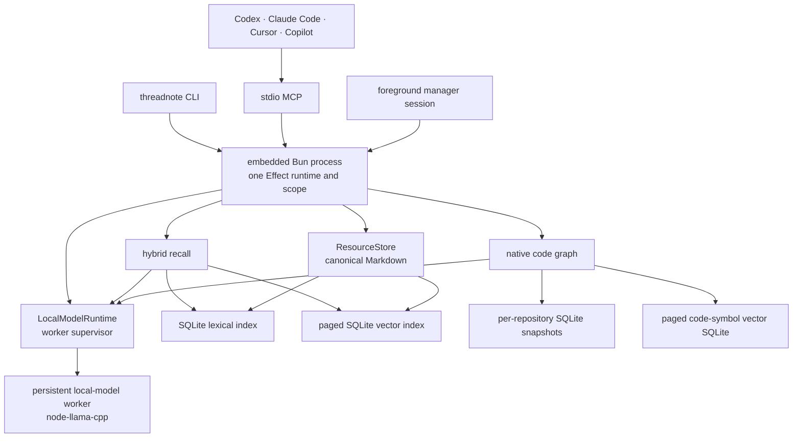

# Threadnote 4 architecture

Threadnote 4 is a self-contained executable with an embedded Bun runtime. Canonical storage, recall indexes, sharing,
migration, the manager, and MCP run in the foreground Threadnote process. Local inference runs in one supervised child
of that process, launched from the same standalone executable so a native-addon crash cannot take down the CLI or MCP
server. A normal operation does not start or contact a separately installed runtime, Python service, memory-platform
server, database server, or background daemon.

## Runtime contract

- Bun `1.3.14` is pinned for builds and embedded into every release executable; users do not install a runtime.
- Release compilation gates cover every base target supported by Bun: macOS arm64/x64, Linux arm64/x64 with glibc and
  musl, and Windows arm64/x64. Shipped local-AI archives are limited to the six targets with a compatible prebuilt
  `node-llama-cpp` payload.
- Bun bytecode compilation, minification, and linked source maps are enabled for standalone executables.
- Each CLI, MCP, or manager process owns one root Effect runtime and one root scope.
- The parent lazily starts one persistent local-model worker. The worker owns a minimal Effect runtime, keeps model
  sessions warm, serves serialized stdio requests, and exits with its parent.
- MCP uses stdio. The manager starts a temporary loopback HTTP server only for the foreground manager session.
- `node-llama-cpp` is isolated behind one Threadnote adapter and may load only a compatible prebuilt binary.
  Only the local-model worker loads that adapter; Threadnote does not silently compile llama.cpp or invoke Python.

## Owned home and data authority

`~/.threadnote` is the only runtime-owned home.

| Path                                   | Purpose                                                                          | Authority               |
| -------------------------------------- | -------------------------------------------------------------------------------- | ----------------------- |
| `data/<account>/`                      | Canonical resources, personal memories, and ingested shared memories             | Authoritative           |
| `models/`                              | Verified, immutable GGUF model files and role selection                          | Re-downloadable state   |
| `indexes/lexical/active-v3.sqlite`     | Normalized metadata, postings, statistics, and trigram exact search              | Derived and disposable  |
| `indexes/vectors/<model>/`             | Paged content-addressed Float32 vectors and transactional active metadata        | Derived and disposable  |
| `indexes/code-graph/repositories/`     | Git-snapshot-aware source symbols, relationships, lexical terms, and vectors     | Derived and disposable  |
| `share/`                               | Team configuration and isolated Git worktrees/gitdirs                            | Operational integration |
| `migration/`, `locks/`, `logs/`, `tmp` | Receipts, bounded cross-process coordination, diagnostics, and temporary staging | Operational state       |

Ordinary files and stable `threadnote://` identifiers remain authoritative. SQLite and vector formats may be replaced
or rebuilt without migrating canonical content.

## Recall pipeline

1. Share repositories auto-sync only when their worktrees are clean.
2. The SQLite index returns bounded lexical candidates and corpus statistics without loading a monolithic JSON cache.
3. The automatically installed BGE Small model embeds the query in the supervised local-model worker. Exact cosine
   search pages the active SQLite vector rows without decoding or caching the corpus as a JavaScript array.
4. The hybrid ranker combines lexical, exact-term, field, semantic, scope, lifecycle, authority, time, graph, feedback,
   and—only when explicitly selected—reranker signals.
5. Confidence and no-answer gates prevent weak semantic-only matches from becoming answers.
6. Recall returns ranked pointers and compact explanations; the agent reads only selected `threadnote://` records.

The 36.7 MB BGE Small embedding model is core functionality. `threadnote install` and `threadnote repair` download,
verify, select, and preserve it automatically. Reranking and structured generation remain optional roles. If native
inference is temporarily unavailable, recall fails open to deterministic lexical results and doctor reports the
missing core capability.

The worker is lazy and remains alive for its parent process to reuse loaded models. A transport crash, exit, protocol
fault, closed input, or request deadline causes the parent to discard it and retry the operation once with a fresh
worker. A repeated fault is returned as a typed bounded failure. On Darwin arm64, the built-in BGE Small manifest
requests zero GPU layers. The packaged Metal addon still initializes its backend, so this is a targeted mitigation for
the observed release-runner failure, not root-cause proof and not a policy applied to optional models.

## Native code graph

Code search is a separate concern from memory recall. `recall_context` answers what the team learned, decided, or
handed off from canonical memories and seeded resources. `inspect_code_graph` answers what current source defines,
calls, imports, extends, documents, or may affect. An agent can call both, but graph indexing never runs as a side
effect of recall and graph evidence cannot turn a memory no-answer into an answer.

The graph inventory reads committed files through bounded Git tree/blob plumbing and overlays eligible staged,
unstaged, deleted, renamed, and untracked worktree files after containment and ignore checks. Uncached source is parsed
into the SQLite-backed content-addressed fact cache in bounded batches, and ordinary source text is released before the
next batch. Package and workspace configuration is retained only as compact resolution metadata. Repository admission
and graph coverage are not capped by file bytes, file count, resolution metadata, symbols, edges, lexical terms, or
vectors. Fixed-size parser and SQLite batches bound transient work without truncating the stored graph, and completed
parser batches are reusable after interruption.

A generated language-pack catalog owns classification, extraction, cache identity, verified assets, capabilities,
workspace discovery, and resolution domains. TypeScript/JavaScript continues to use the pinned TypeScript compiler
extractor. Java, Kotlin, and Swift use bundled, checksum-verified Tree-sitter WASM grammars and a backend-neutral
normalized declaration/reference representation. Manifests and Markdown remain built-in data extractors. Adding a
future first-party language requires a pack plus fixtures/assets, not changes to inventory, SQLite, query, CLI, or MCP
code. Every edge identifies its evidence and authority as declared, resolved, syntactic, heuristic, or model-derived;
semantic similarity is never promoted to an authoritative source edge.

Each local Git checkout owns a SQLite graph under
`~/.threadnote/indexes/code-graph/repositories/<checkout-id>/`. Linked worktrees share an immutable commit snapshot;
dirty overlays store only changed facts and deletion markers, while active pointers remain worktree-scoped. Independent
clones of the same remote have separate operational stores. Builds stage, revalidate, and promote transactionally;
dirty activation stages complete current rows in bounded batches and compares them with the immutable base through
indexed SQL joins instead of issuing per-symbol or per-edge comparison queries. One scoped SQLite connection serves all
store calls in a logical query or export. Concurrent readers pin snapshots with bounded leases instead of taking the
writer lock. Repository registration uses a short process-aware maintenance lease and a writer-intent marker so repair
and purge cannot remove a graph being created, without serializing extraction or model work across repositories.
Code-symbol vectors use a per-model `vectors-v2.sqlite`: construction, fingerprint reuse, activation, pruning, and
exact search are paged, and worktree pointers switch generations transactionally. No repository-sized symbol array or
decoded vector sidecar is required. Missing models fail open to indexed SQLite lexical postings.

One Git checkout is one graph scope, including monorepos. Nested package manifests assign symbols to the deepest
containing project/source root. Static detectors cover npm/TypeScript metadata, Maven modules, Gradle projects and
conventional Android/Kotlin Multiplatform source sets, SwiftPM targets, and conservative Xcode project scope. These
scopes disambiguate resolution; they are not graph partitions. A nested app can remain its own workspace and also be
an integrated outer module: its project retains both workspace roots and can cross into outer `libs/` or inner modules
only through declared dependencies. Java and Kotlin intentionally share the JVM resolution domain. Duplicate or
dynamic targets remain unresolved instead of creating false edges.
Nested Git repositories and submodules keep separate graph identities and are not traversed from the parent checkout.
`threadnote graph status|index|query|explain|path|impact|watch|export|purge` provides the operator surface. Doctor reports
graph integrity and incomplete builds; repair discards only corrupt derived databases, abandoned snapshots, and
temporary vector files.

The first query builds a graph lazily. MCP gives a cold or strict-freshness build a short bounded opportunity to
complete; a large monorepo then receives a structured `indexing` result with phase and retry timing while a deduplicated
session-scoped build continues. A retry uses the newly activated snapshot without tying tool latency to repository
size. Later `query` and `explain` calls may return a ready stale snapshot immediately and disclose that freshness while
the watcher catches up; stale `path` and `impact` return the same retryable indexing state until a current snapshot is
ready. One-shot CLI graph queries synchronously refresh stale snapshots because their application scope ends with the
command. A CLI writer that encounters an active build reports a waiting phase and waits interruptibly, with dead-owner
recovery but no arbitrary graph-lock deadline. The first MCP graph inspection starts one scoped watcher per worktree
for that MCP session. `graph watch` exposes the same watcher as a foreground CLI command. Both watcher modes subscribe
to worktree filesystem events, ignore hidden-directory noise, debounce bursts, and perform a full Git reconciliation
every five minutes to recover missed events.

## Writes and sharing

Canonical writes validate URI segments and containment, reject escaping links, coordinate writers with bounded
heartbeat locks, and commit same-directory temporary files by atomic rename. Replacement uses compare-and-swap where
the lifecycle contract requires it.

Team sharing is explicit. `share publish` scrubs the candidate, writes and verifies the shared copy, commits and pushes
the team Git worktree, and only then removes the personal source. Personal handoffs and preferences are not
publishable. Recall and read auto-sync clean incoming team changes before searching.

## Migration boundary

Legacy 3.x storage is input to a one-time, non-destructive migration, not a runtime dependency. Migration inventories,
stages, hashes, validates, and promotes canonical content into `~/.threadnote`, then writes a matching receipt. Repair
uses the actual legacy-home and receipt state, so a completed migration is not advertised again even if post-update
prompt bookkeeping is absent. The legacy source remains untouched as a rollback source.

## Effect boundaries

Effect provides capability services, scopes, typed failures, interruption, concurrency, and test substitution. Domain
modules depend on Threadnote-owned ports. Raw filesystem, process, HTTP, digest, SQLite, and native-addon access stays
inside adapters, and tests replace those services with Layers instead of starting hidden local servers. Native
inference additionally crosses the bounded worker protocol so a memory-safety failure remains outside the long-lived
CLI, MCP, or manager parent.
