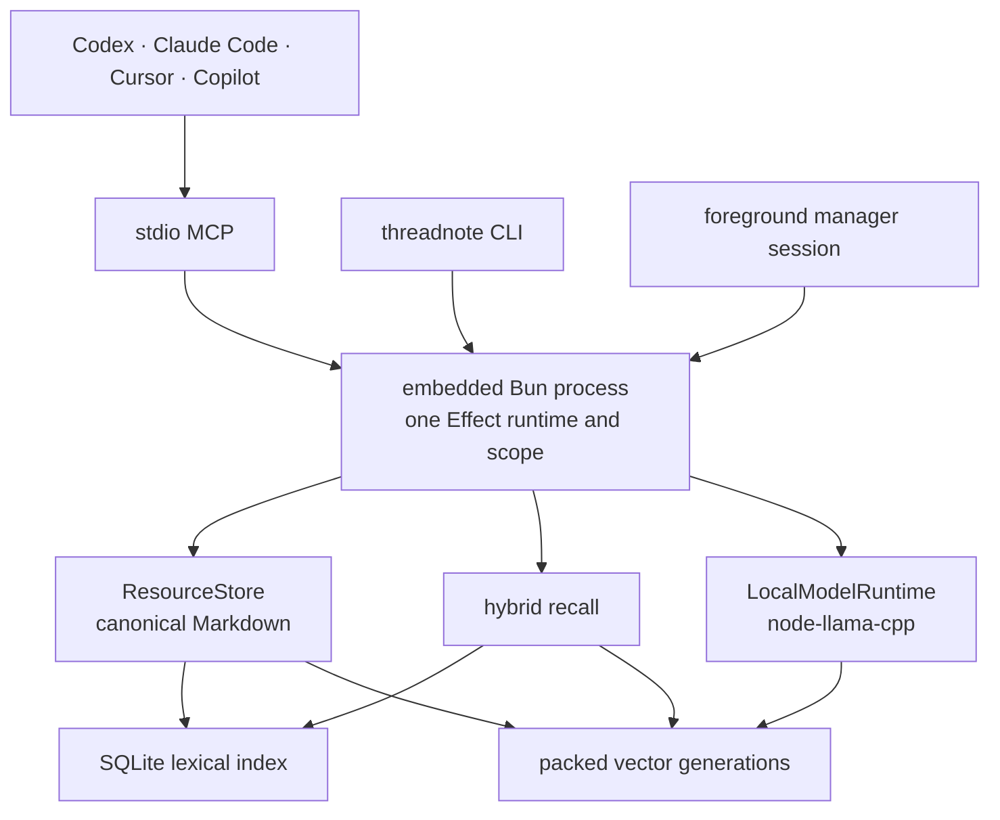

# Threadnote 4 architecture

Threadnote 4 is a self-contained executable with an embedded Bun runtime. Canonical storage, recall indexes, local
inference, sharing, migration, the manager, and MCP all run in the Threadnote process. A normal operation does not
start or contact a separately installed runtime, Python service, memory-platform server, database server, or
background daemon.

## Runtime contract

- Bun `1.3.14` is pinned for builds and embedded into every release executable; users do not install a runtime.
- Release compilation gates cover every base target supported by Bun: macOS arm64/x64, Linux arm64/x64 with glibc and
  musl, and Windows arm64/x64. Shipped local-AI archives are limited to the six targets with a compatible prebuilt
  `node-llama-cpp` payload.
- Bun bytecode compilation, minification, and linked source maps are enabled for standalone executables.
- Each CLI, MCP, or manager process owns one root Effect runtime and one root scope.
- MCP uses stdio. The manager starts a temporary loopback HTTP server only for the foreground manager session.
- `node-llama-cpp` is isolated behind one Threadnote adapter and may load only a compatible prebuilt binary.
  Threadnote does not silently compile llama.cpp or invoke Python.

## Owned home and data authority

`~/.threadnote` is the only runtime-owned home.

| Path                                   | Purpose                                                                          | Authority               |
| -------------------------------------- | -------------------------------------------------------------------------------- | ----------------------- |
| `data/<account>/`                      | Canonical resources, personal memories, and ingested shared memories             | Authoritative           |
| `models/`                              | Verified, immutable GGUF model files and role selection                          | Re-downloadable state   |
| `indexes/lexical/active-v2.sqlite`     | Normalized document metadata, terms, postings, and corpus statistics             | Derived and disposable  |
| `indexes/vectors/<model>/`             | Checksummed active pointer plus immutable packed vector generations              | Derived and disposable  |
| `share/`                               | Team configuration and isolated Git worktrees/gitdirs                            | Operational integration |
| `migration/`, `locks/`, `logs/`, `tmp` | Receipts, bounded cross-process coordination, diagnostics, and temporary staging | Operational state       |

Ordinary files and stable `threadnote://` identifiers remain authoritative. SQLite and vector formats may be replaced
or rebuilt without migrating canonical content.

## Recall pipeline

1. Share repositories auto-sync only when their worktrees are clean.
2. The SQLite index returns bounded lexical candidates and corpus statistics without loading a monolithic JSON cache.
3. The automatically installed BGE Small model embeds the query in process. Exact cosine search reads the active
   packed vector generation.
4. The hybrid ranker combines lexical, exact-term, field, semantic, scope, lifecycle, authority, time, graph, feedback,
   and—only when explicitly selected—reranker signals.
5. Confidence and no-answer gates prevent weak semantic-only matches from becoming answers.
6. Recall returns ranked pointers and compact explanations; the agent reads only selected `threadnote://` records.

The 36.7 MB BGE Small embedding model is core functionality. `threadnote install` and `threadnote repair` download,
verify, select, and preserve it automatically. Reranking and structured generation remain optional roles. If native
inference is temporarily unavailable, recall fails open to deterministic lexical results and doctor reports the
missing core capability.

## Writes and sharing

Canonical writes validate URI segments and containment, reject escaping links, coordinate writers with bounded
heartbeat locks, and commit same-directory temporary files by atomic rename. Replacement uses compare-and-swap where
the lifecycle contract requires it.

Team sharing is explicit. `share publish` scrubs the candidate, writes and verifies the shared copy, commits and pushes
the team Git worktree, and only then removes the personal source. Personal handoffs and preferences are not
publishable. Recall and read auto-sync clean incoming team changes before searching.

## Migration boundary

Legacy 3.x storage is input to a one-time, non-destructive migration, not a runtime dependency. Migration inventories,
stages, hashes, validates, and promotes canonical content into `~/.threadnote`, then writes a matching receipt. Repair
uses the actual legacy-home and receipt state, so a completed migration is not advertised again even if post-update
prompt bookkeeping is absent. The legacy source remains untouched as a rollback source.

## Effect boundaries

Effect provides capability services, scopes, typed failures, interruption, concurrency, and test substitution. Domain
modules depend on Threadnote-owned ports. Raw filesystem, process, HTTP, digest, SQLite, and native-addon access stays
inside adapters, and tests replace those services with Layers instead of starting hidden local servers.
