# Native code graph implementation plan

Status: first production scope implemented; later polyglot/community adapters remain phased
Target release: Threadnote 4.0
Last updated: 2026-07-29

Related contracts:

- [Threadnote 4 architecture](architecture.md)
- [ADR 013: evaluation and benchmark governance](adr/013-evaluation-and-benchmark-governance.md)
- [ADR 014: native canonical storage and derived indexes](adr/014-native-storage-and-indexes.md)
- [ADR 015: Effect AI and node-llama-cpp](adr/015-effect-ai-and-node-llama-cpp.md)

## Outcome

Threadnote will provide Graphify-class code navigation and relationship retrieval as a self-contained, local derived
index. It will not require Python, a daemon, a database server, a copied graph directory, or a graph synchronized
between Git worktrees.

The feature is successful when an agent can use one compact, dedicated code-graph tool to answer:

- where a concept, symbol, module, or contract is defined;
- how two code concepts are connected;
- what imports, calls, implements, tests, configures, or depends on something;
- what code is likely affected by a file, symbol, or Git diff;
- which memories and seeded resources explain the selected code;
- whether the evidence describes the current commit and dirty worktree.

Code graph data is disposable. Repository files, Git history, and Threadnote's existing canonical resources remain
authoritative.

## Non-negotiable constraints

1. A normal operation must not invoke Python, Graphify, a language-server daemon, or a network service.
2. Every executable retains one root Effect runtime and scope. Domain services must not create hidden runtimes.
3. Graph facts are stored below `~/.threadnote/indexes/`; no graph data becomes canonical memory.
4. Worktrees must never share mutable branch state. A query in one worktree must not see another worktree's dirty
   overlay.
5. Extracted and compiler-resolved relationships are distinguishable from heuristic or model-inferred relationships.
   Local AI output is never silently promoted to an authoritative edge.
6. A partial, interrupted, corrupt, or incompatible build must never replace the latest complete compatible snapshot.
7. Lexical Threadnote recall remains available if code-graph parsing, embedding, or query expansion fails.
8. All stored source locations are repository-relative. Secret-bearing remote URLs and absolute checkout paths must
   not enter portable graph records or exports.
9. Traversal is streaming and bounded. Ignored directories are pruned before descent, symbolic links are not followed,
   and a pathological monorepo cannot exhaust the process heap.
10. Quality and safety are gated by category against checked-in baselines. A blended improvement cannot hide
    no-answer, scope, lifecycle, worktree-isolation, or false-edge regressions.

## Scope

### First production scope

- Git repository, checkout, commit, and dirty-overlay identity.
- Content-addressed parsing and incremental snapshot activation.
- Declarative package dependencies already supported by `src/graph.ts`.
- Compiler-resolved TypeScript and JavaScript modules, declarations, exports, references, inheritance, implementation,
  and calls where the compiler can resolve them.
- Deterministic structural fallback when a TypeScript program cannot be constructed.
- SQLite symbol search and relation-aware graph traversal.
- Embedding retrieval for a bounded set of high-value nodes through the existing core embedding model.
- `query`, `explain`, `path`, and `impact` operations through CLI and MCP.
- A dedicated graph MCP contract that remains separate from memory/resource recall.
- Status, progress, doctor, repair, purge, and on-demand export.
- macOS, Linux, and Windows standalone-package coverage.

### Later adapters covered by this plan

- SCIP ingestion as the preferred high-fidelity polyglot interchange.
- Built-in structural extractors for Go and other prioritized languages.
- Optional deterministic community detection and local labels.
- Manager visualization after the query and correctness contracts are stable.

### Non-goals

- Replacing Git, source files, or Threadnote resources with a canonical graph database.
- Reimplementing every language compiler or claiming semantic call-graph parity for unsupported languages.
- Running a persistent Threadnote daemon solely to keep graphs warm.
- Treating directory proximity, embedding similarity, or LLM output as a resolved source relationship.
- Generating a large JSON, Markdown report, or HTML bundle on every update.
- Publishing source graphs through Threadnote memory shares.
- Agent orchestration, autonomous code changes, PR management, or CI control.

## Current foundation

Threadnote already has most of the runtime substrate:

- `src/graph.ts` extracts deterministic npm and Go manifest dependencies and emits `.graph.md` resources.
- `src/recall/index.ts` owns normalized SQLite lexical indexes, incremental transactions, generation invalidation,
  recovery, and bounded locks.
- `src/search/vector-index.ts` owns immutable, checksummed vector generations with checkpoint reuse.
- `src/effect/ai/local-model-runtime.ts` provides in-process embedding through `node-llama-cpp`.
- `src/utils.ts` resolves remote-aware project names and Git common directories.
- `src/recall/runtime.ts` already combines lexical candidates, semantic scores, feedback, graph-like memory references,
  and optional reranking.
- `src/effect/runtime.ts` composes application services into one runtime.

The native code graph must reuse these contracts instead of introducing a second lifecycle, model registry, locking
scheme, query renderer, or benchmark format.

## Target architecture

```mermaid
flowchart LR
    Caller["callerCwd / Git worktree"] --> Identity["RepositoryIdentity"]
    Identity --> Freshness["CodeGraphFreshness"]
    Freshness --> Snapshot["Commit snapshot + dirty overlay"]
    Snapshot --> Scan["Bounded source inventory"]
    Scan --> Extractors["Language extractors"]
    Extractors --> Resolver["Snapshot symbol resolver"]
    Resolver --> Store["Per-repository SQLite graph"]

    Store --> Search["Exact / lexical symbol search"]
    Store --> Traverse["Relation-aware traversal"]
    Store --> VectorInput["High-value node projection"]
    VectorInput --> Embedding["Existing LocalModelRuntime"]
    Embedding --> Vectors["Immutable vector generation"]
    Vectors --> Search

    Search --> Query["CodeGraphQuery"]
    Traverse --> Query
    Query --> Tool["inspect_code_graph"]
    Query --> CLI["threadnote graph"]

    Resources["Memories and resources"] --> Links["Derived code links"]
    Links --> Store
    Agent["Agent orchestration"] --> Query
    Agent --> Recall["recall_context<br/>memory and resources only"]
```



## Owned layout

Each local Git checkout gets an isolated graph root shared by its linked worktrees:

```text
~/.threadnote/
  indexes/
    code-graph/
      repositories/
        <checkout-id>/
          graph-v2.sqlite
          vectors/
            <model-id>/
              generations/
  locks/
    indexes/
      code-graph/
        <checkout-id>.lock
```

Checkout IDs are hashes of the resolved Git common directory. Absolute checkout paths are never copied into graph
snapshots, model input, diagnostics intended for publication, or exports.

The graph database and vector generations are derived and may be deleted or rebuilt. Deleting them must not touch Git
repositories, canonical Threadnote data, model files, or share worktrees.

## Repository and snapshot identity

### Repository identity

`RepositoryIdentity` resolves:

- `repositoryId`: SHA-256 of a versioned, credential-free repository identity;
- `displayName`: sanitized owner/name or repository folder label;
- `checkoutId`: local hash of the resolved Git common directory;
- `worktreeId`: local hash of the resolved top-level path;
- `repoRoot`: current absolute top-level path, held only for the operation;
- `headCommit`: full object ID when `HEAD` exists;
- `objectFormat`: Git object format;
- `caseMode`: path-comparison mode derived from Git and platform behavior.

Identity preference:

1. normalized fetch remote URL with userinfo, credentials, query, and fragment removed;
2. normalized Git common directory identity when no safe remote exists;
3. an explicit typed failure outside a Git repository.

Different worktrees from one clone share `repositoryId`, `checkoutId`, and committed snapshots. Independent clones with
the same normalized remote use separate checkout-local databases so active-pointer and garbage-collection decisions
cannot interfere. Cross-checkout content reuse can be added later without sharing mutable lifecycle state.

Repository identity format is versioned. Changing normalization creates a new derived graph root unless a tested
identity migration proves both identities equivalent.

### Committed snapshots

A committed snapshot is identified by:

```text
repository-id + object-format + commit-object-id + extractor-set-hash
```

The extractor-set hash includes every enabled extractor name, schema version, parser/compiler version, resolution
policy, ignore-policy version, resolution-context policy, and feature flag that can alter facts. Authoritative
resolution must not depend on untracked tools or arbitrary `node_modules` contents unless those inputs are explicitly
inventoried and hashed. External packages otherwise remain declared external targets.

Snapshots move through `building`, `ready`, `failed`, and `retired` states. Queries only read `ready` snapshots.
Graph activation is one SQLite transaction after inventory, extraction, resolution, and validation are complete.
Embeddings are fail-open derived data and do not block deterministic graph activation.

### Dirty overlays

The graph must represent the files the agent can currently read, including staged, unstaged, deleted, renamed, and
eligible untracked files. The overlay identity includes:

```text
base snapshot + normalized changed-path set + content hashes + deletion markers + overlay-policy version
```

Only changed paths are parsed and re-resolved. Unchanged facts come from the committed snapshot. Overlay rows are
scoped by `worktreeId`; they cannot be selected by another worktree query.

A file changing during indexing invalidates that overlay build. The indexer retries a bounded number of times and then
returns a typed source-mutation result while leaving the previous ready snapshot usable.

## Source inventory and safety

Committed inventory should come from streaming Git plumbing rather than a recursive filesystem walk:

- stream the selected commit with `git ls-tree -r -z`;
- stream accepted blobs through `git cat-file --batch`;
- filter paths, modes, languages, and sizes before materializing content;
- treat submodule gitlinks as separate repository references instead of descending into them;
- skip symbolic-link blobs and detect Git LFS pointers rather than indexing a pointer as source;
- derive changed, deleted, renamed, and untracked overlay paths from `git status --porcelain=v2 -z`;
- read only accepted overlay files from the verified worktree boundary.

This makes committed snapshots independent of sparse checkout state, avoids walking `node_modules`, and gives every
tracked input an exact Git object identity. The overlay inventory must be shared with, or conform to the same safety
contract as, Threadnote seeding:

- apply `.gitignore`, `.threadnoteignore`, and built-in generated/vendor/cache rules during traversal;
- prune every directory whose basename starts with `.`;
- prune `node_modules`, build output, package caches, coverage output, and known workspace caches before descent;
- never follow filesystem symbolic links or Git links outside the repository boundary;
- reject files above a configured byte limit before reading;
- skip binary and unsupported files without retaining their bytes;
- stream candidates through bounded queues instead of materializing the repository inventory;
- cap visited entries, indexed files, individual-file bytes, retained resolution metadata, symbols, edges, parser
  commands, and query time without rejecting a repository solely because its aggregate eligible source bytes are large;
- persist completed parser batches as resumable checkpoints so an interrupted large build does not restart from zero;
- report skipped and failed files in a summary rather than hiding them among per-file output;
- continue with other files where a file-local failure is safe;
- fail the snapshot, not the process, when a repository-wide invariant fails.

Explicit single-file queries may inspect a hidden file at the repository root, but recursive discovery does not descend
into hidden directories.

## Data model

The exact DDL belongs in the implementation ADR. The following logical tables are required.

### Metadata and lifecycle

- `schema_metadata`: schema version, mutation sequence, integrity sequence, and feature versions.
- `repositories`: repository ID, sanitized display metadata, object format, and creation/last-used times.
- `extractor_sets`: versioned extractor and policy identity.
- `snapshots`: repository, commit, optional base snapshot, optional worktree overlay identity, lifecycle state, counts,
  hashes, timings, and failure summary.
- `snapshot_files`: full committed membership or worktree-overlay file deltas.
- `snapshot_file_deletions`: paths removed by a worktree overlay.
- `snapshot_leases`: bounded reader pins that keep a selected ready snapshot alive during concurrent replacement.

### Content-addressed parsing

- `file_blobs`: content hash, language, byte size, parser identity, and parse status.
- `parsed_symbols`: blob-local symbol ID, kind, name, signature, visibility, span, and bounded documentation.
- `parsed_relations`: blob-local source, relation, target reference, source span, and provenance.
- `manifest_facts`: package/module identity and declared dependency facts.

Source file bytes are not duplicated into SQLite. Store only the bounded text required for search and evidence, such as
names, signatures, and documentation fragments. Query hydration reads the current bounded source or a Git object after
verifying repository containment and snapshot identity.

### Snapshot resolution

- `symbols` plus `snapshot_symbol_deletions`: full committed symbols or dirty-overlay changes/tombstones.
- `edges` plus `snapshot_edge_deletions`: full committed edges or dirty-overlay changes/tombstones.
- `unresolved_references`: normalized target reference and diagnostic reason.
- `snapshot_packages`: packages, workspace membership, manifests, and external dependency counts.

Stable symbol identity uses repository ID, normalized relative path, language, kind, and qualified declaration
identity. Renames may create explicit alias/history rows after Git rename detection, but must not guess identity from
embedding similarity.

### Retrieval

- `symbol_terms`: bounded normalized postings over qualified name, simple name, signature, documentation, path,
  package, and module.
- `node_statistics`: degree by relation, hub penalties, usage counts, and traversal weights.
- `resource_code_links`: derived links from Threadnote resources/memories to snapshot symbols or paths, including
  evidence and confidence.
- `vector_generations`: immutable sidecar identity, model/template versions, checksums, dimensions, counts, and build
  status.
- `snapshot_vector_generations`: transactionally associates a complete vector generation with one ready snapshot.
- `communities`: optional deterministic community membership and algorithm version.
- `community_labels`: optional local generated label, model identity, input hash, and generation status.

SQLite connections enable foreign keys, bounded busy timeouts, WAL, and integrity metadata. Indexes must cover snapshot
and worktree selection, symbol identity, path, source/target adjacency, relation, qualified-name lookup, and cleanup.

## Relationship contract

Every edge has one provenance tier:

| Tier        | Examples                                               | Authority and query behavior                                    |
| ----------- | ------------------------------------------------------ | --------------------------------------------------------------- |
| `declared`  | package manifest, project reference                    | Authoritative declarative fact                                  |
| `resolved`  | compiler or SCIP-resolved symbol reference             | Authoritative within recorded extractor/compiler limits         |
| `syntactic` | AST call/import shape without complete name resolution | Useful evidence; never presented as fully resolved              |
| `heuristic` | test/source convention, filename convention            | Optional expansion with explicit explanation and reduced weight |
| `model`     | semantic similarity or local-AI inferred relationship  | Never a factual path edge; opt-in semantic association only     |

Required initial relations include:

- `contains`, `declares`, `exports`, and `references`;
- `imports`, `reexports`, and `depends_on`;
- `calls`, `constructs`, and `reads_or_writes`;
- `extends`, `implements`, and `overrides`;
- `tests`, `configures`, and `documents`;
- `semantic_association` for non-authoritative embedding or model links.

The query renderer must say when an edge is syntactic, unresolved, heuristic, or model-derived. It must never collapse
all tiers into a generic “related” statement.

## Extractor design

### Effect boundary

```ts
interface CodeGraphExtractor {
  readonly id: string;
  readonly version: string;
  readonly languages: ReadonlySet<string>;
  readonly inventoryHints: InventoryHints;
  readonly extract: (
    input: ExtractorInput,
  ) => Effect.Effect<ExtractedFileFacts, ExtractionError, ExtractorRequirements>;
}
```

Extractors return data. They do not write SQLite, load models, start runtimes, traverse outside the supplied file, or
render agent output.

### Initial extractors

1. `ManifestExtractor`
   - moves the current npm and Go facts behind the extractor contract;
   - adds workspace/package membership and source roots;
   - remains deterministic and independently testable.
2. `TypeScriptSyntaxExtractor`
   - parses TS, TSX, JS, JSX, MJS, CJS, MTS, and CTS;
   - emits declarations, modules, imports/exports, structural references, and spans;
   - provides useful partial facts when semantic program construction is unavailable.
3. `TypeScriptProgramResolver`
   - recognizes project references, path mappings, workspace packages, package exports, and declaration files;
   - resolves cross-file declarations, inheritance, implementations, references, and calls where supported;
   - records diagnostics and unresolved targets instead of manufacturing edges;
   - enforces memory and time budgets per program.
4. `DocumentationExtractor`
   - indexes Markdown headings, links, code references, and explicitly named source paths;
   - emits `documents` relations without treating prose similarity as a source dependency.

### Polyglot extension

Add extractors through one of two paths:

- import a versioned SCIP index produced by a trusted user-selected indexer; or
- ship a bounded structural parser inside Threadnote.

SCIP imports remain derived and optional. Missing external indexers cannot break native TS/JS or manifest support.
Imported data is validated for containment, size, schema, path normalization, and symbol uniqueness before activation.

## Effect services

### `RepositoryIdentity`

- resolves repository, checkout, worktree, commit, and case/path policy;
- reads Git through `CommandExecutor`;
- produces credential-free typed identities;
- never writes graph state.

### `CodeGraphStore`

- owns schema initialization and migration;
- opens scoped Effect SQL connections;
- creates build snapshots and atomically activates complete snapshots;
- provides content-hash caches, adjacency reads, FTS reads, statistics, and garbage collection;
- keeps graph storage independent of parsing and output rendering.

### `CodeGraphExtractorRegistry`

- selects extractors by language and configuration;
- computes the extractor-set hash;
- rejects duplicate ownership or incompatible extractor versions.

### `CodeGraphIndexer`

- performs bounded inventory, content hashing, cache reuse, extraction, resolution, validation, and activation;
- uses a per-repository heartbeat lock and bounded worker queues;
- emits structured progress;
- never exposes partial snapshots.

### `CodeGraphFreshness`

- compares current repository/worktree identity with ready snapshots;
- chooses `current`, `cheap incremental`, `stale usable`, `refresh scheduled`, or `full build required`;
- marks snapshots stale from hooks without doing expensive hook work;
- owns foreground watch debouncing but does not create a daemon.

### `CodeGraphEmbeddingIndex`

- projects high-value graph nodes to stable embedding text;
- reuses `LocalModelRuntime`, model selection, checkpoints, checksums, and atomic generations;
- fails open to exact/FTS graph search;
- isolates vector implementation so an ANN replacement does not alter graph or canonical data.

### `CodeGraphQuery`

- resolves the appropriate ready snapshot and worktree overlay;
- performs exact/FTS/vector seeding, bounded traversal, path search, and impact analysis;
- returns typed evidence independent of CLI or MCP formatting;
- never mutates a graph as a side effect of rendering.

### `CodeGraphEnrichment`

- optionally labels communities or summarizes a selected bounded subgraph with local generation;
- records model, prompt/schema version, and input hash;
- cannot create `declared`, `resolved`, or `syntactic` edges.

All services are supplied from `ApplicationLayer`. Tests replace them with Layers; production code does not use module
monkey-patching or nested runtimes.

## Freshness and concurrency

### Query modes

- **Require fresh:** explicit index, path, and impact commands wait for a complete current snapshot and show progress.
- **MCP latency bounded:** MCP `query` and `explain` use the newest compatible ready snapshot without synchronously
  rebuilding a stale graph. The response reports the snapshot commit and any stale or dirty-overlay limitation. The
  first MCP graph inspection starts a deduplicated worktree watcher scoped to that MCP process.
- **One-shot CLI fresh:** `graph query`, `graph explain`, `graph path`, and `graph impact` synchronously refresh a stale
  graph because a short-lived CLI process has no session scope in which a watcher could remain alive. The foreground
  CLI watcher is available when continuous indexing is useful outside MCP.
- **Read only:** status, doctor, and export never trigger an unrequested full rebuild.

An MCP process owns its deduplicated repository subscriptions for the session lifetime, while the optional watch
command owns one subscription for the command lifetime. Neither is a daemon.

### Locks and transactions

- one writer lock per repository;
- concurrent readers continue using ready snapshots;
- a second writer rechecks freshness after acquiring the lock;
- extraction checkpoints are keyed by content hash and extractor version;
- graph snapshot activation is transactional;
- an immutable vector sidecar is associated with a snapshot in a later transaction only after checksum verification;
- an orphan sidecar is disposable, and a failed vector build leaves deterministic graph queries available;
- stale lock recovery reuses Threadnote's process identity and heartbeat rules;
- interruption marks or removes only the incomplete build;
- repair can discard incomplete derived state without asking to alter canonical data.

### Watch mode

`threadnote graph watch` is an optional foreground command:

- subscribes to filesystem changes inside one worktree;
- debounces event bursts before performing bounded incremental updates;
- periodically performs a full Git reconciliation to recover missed events;
- exits cleanly and releases all watchers, locks, database connections, and native resources.

## Retrieval and ranking

### Seed selection

Generate a bounded union of:

- exact qualified-name, simple-name, package, module, and relative-path matches;
- SQLite FTS matches over symbol and documentation fields;
- embedding matches for indexed high-value nodes;
- explicit paths or symbols derived from the user's Git diff;
- source references found in already selected Threadnote memories/resources.

Do not embed every token, local variable, or syntax node. Initial vector candidates are exported declarations,
functions, methods, types, modules, packages, documentation sections, and deterministic community summaries.

### Traversal

Traversal is relation-aware:

- default depth is small and operation-specific;
- maximum nodes, edges, fan-out, elapsed time, and output tokens are mandatory;
- ubiquitous hubs receive inverse-degree penalties;
- low-authority tiers cannot displace exact or resolved evidence;
- paths prefer fewer high-confidence edges over shorter heuristic paths;
- cycles are detected and rendered once;
- every returned edge includes its evidence location and provenance.

`path` uses bounded bidirectional search when both endpoints resolve. `impact` traverses reverse relations from changed
files/symbols with relation-specific weights. `explain` returns the smallest evidence subgraph that covers the selected
symbol, its declaration, incoming/outgoing high-value relations, tests, documentation, and relevant memories.

### Recall and graph separation

`recall_context` keeps its current memory/resource ranking authority and never builds or queries a repository graph.
`inspect_code_graph` owns current-source evidence. Agents explicitly call both when a task needs decisions plus source
relationships and combine the two typed responses in their reasoning.

This boundary keeps memory recall fast and predictable, prevents a graph build from becoming surprise recall I/O, and
preserves independent no-answer, freshness, failure, and evaluation contracts. A future derived memory-to-code link
may be returned by `inspect_code_graph`, but it cannot inject a graph answer into recall or modify canonical memory.

## User-facing contract

### CLI

```text
threadnote graph status [--cwd <path>] [--json]
threadnote graph index [--cwd <path>] [--full] [--json]
threadnote graph query --query <text> [--cwd <path>] [--limit <n>] [--json]
threadnote graph explain --symbol <selector> [--cwd <path>] [--json]
threadnote graph path --from <selector> --to <selector> [--cwd <path>] [--json]
threadnote graph impact [--base <git-ref>] [--cwd <path>] [--json]
threadnote graph watch [--cwd <path>]
threadnote graph export --format json|html --output <path> [--cwd <path>]
threadnote graph purge [--cwd <path>] [--all] [--dry-run]
```

Interactive builds show phase and count progress:

```text
Scanning        1,842 files
Parsing         128/231 changed files · 1,611 reused
Resolving       14/14 TypeScript projects
Embedding       320/492 new nodes · 2,113 reused
Activating      snapshot <short-id>
```

Non-interactive output remains bounded and stable. `--json` emits versioned events and a final result suitable for
tests and integrations.

### MCP

Expose one read-only `inspect_code_graph` tool rather than a tool per operation. Its schema includes:

- `operation`: `query`, `explain`, `path`, or `impact`;
- `callerCwd`: required absolute workspace path;
- `query`, `symbol`, `from`, `to`, or `base` as required by the operation;
- `nodeLimit`, `edgeLimit`, `depth`, and optional relation filters;
- `includeHeuristic` and `includeModelAssociations`, both false by default.

The response includes repository identity, snapshot commit, dirty-overlay state, freshness, warnings, nodes, edges,
evidence, and compact rendered text. Write/build behavior remains behind CLI commands or a separately annotated
mutation tool if MCP indexing is later required.

### Manager

The first release adds status and diagnostics, not a visualization-first graph UI. A graph explorer may land only
after:

- query output and IDs are versioned;
- large-graph pagination is tested;
- snapshot switching is explicit;
- the manager does not load an entire graph into the browser;
- export and UI use the same query service.

## Model and vector policy

Threadnote reuses the automatically installed core embedding model. The graph feature does not install another model
by default.

Embedding text is deterministic and versioned:

```text
<kind> <qualified-name>
signature: <bounded-signature>
module: <module>
path: <relative-path>
documentation: <bounded-doc>
```

Vector reuse keys include model hash, embedding-template version, symbol semantic fingerprint, and normalized text
fingerprint. Vectors are normalized and checksummed. Missing or incompatible vectors trigger lexical graph search and
a repairable diagnostic.

Exact vector scan remains the initial implementation over a deterministic ceiling of 20,000 exported/high-value
symbols. Phase 0 and scheduled scale benchmarks must separately measure
10k, 100k, and production-shaped node corpora. Adopt an ANN backend only when a reviewed benchmark demonstrates that
exact scan violates an approved latency, memory, or concurrency budget. The replacement remains behind
`CodeGraphEmbeddingIndex` and cannot change graph facts.

## Compatibility and migration

### Existing `.graph.md` resources

The current `seed --graph` output remains readable during rollout. Native graph indexing initially coexists with it.
After native manifest edges and dedicated graph queries pass parity:

1. mark `.graph.md` generation deprecated;
2. stop generating new files only in a release with documented migration behavior;
3. remove an existing generated resource only when its bytes match Threadnote's recorded generated fingerprint;
4. retain modified or unrecognized `.graph.md` files as user-controlled resources;
5. keep `threadnote://` references valid even when native graph results become the preferred evidence.

### Historical Graphify baseline

The compact Graphify 0.9.29 baseline is a frozen, non-executable Phase 0 comparison. Threadnote does not import
Graphify output, invoke Graphify, preserve a Graphify workspace, or expose Graphify provenance. Production, tests,
install, update, repair, and release artifacts depend only on the native graph implementation.

### Graph schema upgrades

Schema changes create a new versioned graph database or rebuild derived tables. Upgrade and repair:

- inspect without opening incompatible databases for mutation;
- preserve the last compatible ready database until replacement succeeds;
- display rebuild progress;
- never migrate canonical files to satisfy a graph schema;
- provide `graph purge` as the bounded recovery path.

## Privacy and security

- All parsing, graph storage, embedding, and generation are local.
- No repository content or graph metadata is published by memory sharing.
- Remote normalization strips credentials before hashing or logging.
- Production logs record counts, durations, versions, hashes, and bounded sanitized errors—not source text, symbol
  documentation, absolute paths, raw Git remotes, or model prompts.
- JSON/HTML export is explicit, applies output-path containment and overwrite rules, and warns that source identifiers
  may be sensitive.
- MCP results treat repository-controlled names and documentation as untrusted data and delimit them from agent
  instructions.
- Parser resource limits apply before allocations proportional to repository-controlled counts.
- Windows junctions, case-insensitive aliases, reserved names, UNC paths, and drive-root boundaries receive dedicated
  tests.

## Observability and recovery

Structured metrics:

- inventory files/bytes skipped and accepted;
- content-hash cache hits;
- parsed files/symbols/relations by language and provenance;
- unresolved reference counts and top diagnostic categories;
- snapshot and overlay build durations;
- SQLite transaction, lock-wait, query, and traversal timings;
- vector reused/embedded counts and exact-scan timings;
- query seed counts, hub-pruned edges, traversal depth, and output size;
- snapshot age, commit mismatch, and dirty-overlay state.

`threadnote doctor` reports:

- database schema and integrity;
- repository roots known only as sanitized labels;
- ready/building/failed snapshot counts;
- current worktree freshness;
- extractor and compiler availability;
- vector/model compatibility;
- stale locks and abandoned builds;
- disk usage and garbage-collection eligibility.

`threadnote repair` can:

- remove abandoned build rows and staging vectors;
- rebuild corrupt disposable graph databases;
- reconstruct vectors from ready graph facts;
- recover stale graph locks;
- leave repositories and canonical Threadnote data untouched.

## Phase 0 — benchmark and contract

No production code-graph implementation starts before this phase is reviewed.

### Deliverables

- ADR defining authority, repository identity, schema strategy, extractor trust tiers, and rebuild semantics.
- Versioned fixture format under `test/evaluation/fixtures/code-graph-v1/`.
- Small hand-reviewed fixture repositories covering TypeScript/JavaScript, monorepos, project references, path aliases,
  package exports, tests, documentation, declaration files, rename/delete, cycles, unresolved imports, and no-answer
  queries.
- Git worktree fixture with two branches and independent dirty overlays.
- Large generated and production-shaped fixtures with nested `node_modules`, hidden directories, caches, huge files,
  symbolic links, malformed source, and bounded traversal requirements.
- Frozen Graphify baseline artifact and a native-no-graph Threadnote recall baseline.
- Quality evaluator and compact checked-in summary format.
- Process and microbenchmark runners that record runtime, hardware, fixture hash, commit, extractor versions, cold/hot
  timings, peak RSS, database/vector bytes, and counts.
- A packaged-target capability check for SQLite FTS. If a supported executable lacks the required FTS tokenizer,
  symbol search reuses Threadnote's normalized postings design instead of dropping that platform or loading an
  extension.
- Scheduled macOS, Linux, and Windows benchmark workflow consistent with ADR 013.
- Numeric latency, memory, disk, and indexing budgets proposed from the captured baselines and checked in before Phase
  1 merges.

### Required quality categories

- symbol definition and exact lookup;
- module/package dependency;
- call/reference and inheritance;
- path between concepts;
- change impact;
- documentation and memory linkage;
- ambiguous-name disambiguation;
- unsupported/unresolved language behavior;
- no-answer and false-edge safety;
- commit, branch, worktree, and dirty-overlay isolation;
- multilingual natural-language queries over code;
- existing Threadnote memory/resource recall categories.

### Hard safety gates

- zero authoritative false edges in reviewed deterministic fixtures;
- zero cross-repository, cross-commit, or cross-worktree leakage;
- no-answer recall does not regress;
- current recall-v2 global and per-category gates do not regress;
- ignored/symlinked/out-of-bound content never enters a snapshot;
- interruption never activates a partial snapshot;
- baseline artifacts and fixture hashes are reproducible.

### Exit condition

The ADR, fixture, frozen baselines, evaluator, benchmark runners, checked-in summaries, and approved numeric budgets
exist. Phase 0 cannot be waived because an interactive demo looks correct.

## Phase 1 — identity, schema, and store

### Implementation

- Add `RepositoryIdentity` and typed Git identity errors.
- Define repository, checkout, worktree, commit, extractor-set, and overlay identities.
- Add versioned code-graph layout helpers.
- Implement `CodeGraphStore` with SQLite schema, WAL, indexes, integrity metadata, build lifecycle, atomic activation,
  scoped connections, and garbage-collection primitives.
- Add per-repository locking and abandoned-build recovery.
- Add architecture tests enforcing adapter boundaries.

### Tests

- remote formats with credential stripping;
- no-remote repositories and linked worktrees;
- SHA-1 and SHA-256 Git object formats;
- detached HEAD and unborn branches;
- POSIX, Windows drive, UNC, case, and separator behavior;
- schema creation, incompatibility, corruption, interruption, concurrent readers/writers, and lock recovery;
- content-hash reuse without absolute-path persistence.

### Exit condition

Two linked worktrees can create and query isolated empty snapshots in one repository database. Crash injection cannot
replace a ready snapshot or leave an unrecoverable lock.

## Phase 2 — inventory, extraction, and incremental resolution

### Implementation

- Add bounded streaming repository inventory.
- Move manifest facts behind `ManifestExtractor`.
- Implement TypeScript syntax extraction and program resolution.
- Add content-hash parse reuse, snapshot resolution, diagnostics, and dirty overlays.
- Add validation for symbol uniqueness, path containment, target existence, counts, and provenance.
- Add structured CLI progress and JSON events for indexing.

### Tests

- all Phase 0 deterministic fixtures;
- one-file edits, additions, deletions, renames, staged/unstaged combinations, and eligible untracked files;
- two worktrees changing the same path differently;
- source mutation during scan and resolution;
- unsupported/malformed files and partial compiler diagnostics;
- hidden/vendor/cache pruning before descent;
- traversal/file/symbol/edge/time budget exhaustion;
- full rebuild equals incremental result for the same snapshot.

### Exit condition

The native index reproduces every accepted manifest fact, meets the approved deterministic TS/JS accuracy gates, and
produces byte-equivalent normalized query facts from full and incremental builds.

## Phase 3 — exact graph query and CLI

### Implementation

- Add `CodeGraphQuery` exact, FTS, neighborhood, path, and impact operations.
- Add relation weighting, hub penalties, fan-out/depth/time/result budgets, and evidence rendering.
- Add `threadnote graph status|index|query|explain|path|impact|purge`.
- Add versioned JSON result schemas.
- Hydrate bounded source evidence with snapshot/containment verification.

### Tests

- exact selectors and ambiguous-name diagnostics;
- path optimality and deterministic tie breaking;
- cycle handling and hub pruning;
- reverse impact traversal and Git diff selection;
- stale snapshot and dirty-overlay disclosure;
- output token/row limits and hostile symbol/documentation escaping;
- CLI cancellation and progress behavior.

### Exit condition

All graph-query quality gates pass without embeddings. Every answer identifies its repository, commit, overlay,
freshness, evidence locations, and provenance.

## Phase 4 — vectors and dedicated MCP

### Implementation

- Add deterministic high-value node projection and `CodeGraphEmbeddingIndex`.
- Generalize vector checkpoint/generation primitives where reuse is safe; do not duplicate model lifecycle code.
- Add exact vector seed selection with lexical fail-open behavior.
- Register read-only `inspect_code_graph`.
- Keep `recall_context` free of graph execution and graph-shaped output.
- Allow later derived memory/resource-to-code links only in graph results, without modifying canonical documents.

### Tests

- vector reuse after unchanged builds and targeted re-embedding after edits;
- model missing/corrupt/incompatible/interrupted behavior;
- MCP schema, bounds, annotations, error rendering, and cancellation;
- normal recall remains byte-contract independent when graph services fail;
- Graphify baseline comparison and recall-v2 non-inferiority;
- no-answer safety with semantic-only graph matches;
- packaged standalone MCP and CLI with the core model.

### Exit condition

The dedicated graph tool improves the approved graph categories over the no-graph baseline and preserves perfect
approved no-answer/worktree-isolation safety. Existing recall-v2 gates remain unchanged.

## Phase 5 — lifecycle, watch, doctor, and export

### Implementation

- Add `CodeGraphFreshness` modes and scoped background refresh for long-lived processes.
- Add optional foreground watch and cheap stale-marker hooks.
- Add doctor, repair, storage reporting, garbage collection, and progress.
- Add explicit JSON and HTML export using bounded paginated queries.
- Add manager status and diagnostics.
- Add `.graph.md` deprecation telemetry without deleting user-modified resources.

### Tests

- watcher event storms, missed-event reconciliation, rename/delete, and shutdown;
- simultaneous CLI, MCP, manager, and watch readers/writers;
- stale lock, abandoned build, corrupt DB/vector, and insufficient disk recovery;
- snapshot retention for active worktrees and safe garbage collection;
- export overwrite, escaping, pagination, and sensitive metadata warnings;
- install/update/repair flows with visible index progress.

### Exit condition

All lifecycle operations are idempotent, bounded, observable, and recoverable across supported platforms. No test
requires a daemon or Python.

## Phase 6 — polyglot and community adapters

### Implementation

- Add validated SCIP import.
- Select the next built-in language adapters from measured user repositories.
- Add deterministic community computation behind a versioned service.
- Add optional local community labels and subgraph summaries.
- Re-run vector-scaling evaluation and adopt ANN only if its gate is triggered.

### Tests

- SCIP version, containment, duplicate, oversized, malformed, and partial-input handling;
- cross-language package/module references with explicit provenance;
- deterministic community membership for a fixed graph/version;
- local generation schema failure and lexical fallback;
- no model-derived authoritative edges.

### Exit condition

Every language advertises its actual coverage and limitations. Unsupported semantic relations are absent or explicitly
syntactic, never guessed.

## Phase 7 — release hardening

### Cumulative release gates

1. Unit, property, integration, fault-injection, E2E, type, lint, formatting, coverage, build, and package checks pass.
2. Phase 0 baselines remain immutable unless a reviewed fixture-version migration is performed.
3. Global and per-category recall and graph quality gates pass on macOS, Linux, and Windows.
4. Worktree, commit, scope, no-answer, path-containment, and false-edge safety have zero tolerated regressions.
5. Approved 10k, 100k, and production-shaped performance budgets pass on their designated runner classes.
6. Clean install, update, doctor, repair, recall, MCP, graph query, and purge work offline after model installation.
7. Published standalone archives contain no Python, Graphify, external database, compiler daemon, or automatic native
   build path.
8. Third-party notices and source obligations cover every parser/compiler/index format dependency.
9. Documentation, CLI help, MCP schemas, manager diagnostics, release notes, and troubleshooting describe the same
   behavior.
10. Rollback consists only of disabling graph integration or deleting derived graph indexes; canonical data is never
    migrated or deleted.

### Rollout sequence

1. internal opt-in with benchmarks and diagnostics;
2. beta with explicit graph commands and the dedicated MCP tool;
3. release candidate after platform and production-shaped corpus soak;
4. stable only after cumulative gates and migration behavior pass;
5. keep Graphify bootstrap, watch hooks, generated workspaces, and agent instructions removed;
6. deprecate `.graph.md` generation in a later compatible release.

## Proposed implementation slices

Keep changes reviewable and never combine an unmeasured parser, storage migration, retrieval algorithm, and UI in one
pull request.

| Slice | Contents                                                             | Depends on |
| ----- | -------------------------------------------------------------------- | ---------- |
| 0A    | ADR, fixture format, reviewed fixture repositories                   | —          |
| 0B    | Graphify/no-graph baseline capture, evaluator, checked-in summaries  | 0A         |
| 0C    | process/microbench runners, workflow, approved budgets               | 0A         |
| 1A    | repository/checkout/worktree identity and tests                      | 0A         |
| 1B    | SQLite schema, store layer, lifecycle, locking, corruption tests     | 1A         |
| 2A    | bounded inventory and content-addressed parse cache                  | 1B         |
| 2B    | manifest extractor migration                                         | 2A         |
| 2C    | TypeScript syntax extractor                                          | 2A         |
| 2D    | TypeScript program resolver and dirty-overlay resolution             | 2C         |
| 3A    | exact/FTS query, bounded traversal, evidence schemas                 | 2B, 2D     |
| 3B    | status/index/query/explain/path/impact/purge CLI                     | 3A         |
| 4A    | high-value node projection and vector generations                    | 3A         |
| 4B    | `inspect_code_graph` MCP tool                                        | 3B         |
| 4C    | recall/graph separation gates and graph quality evaluation           | 4A, 4B     |
| 5A    | freshness policy, watcher, hooks, doctor, repair, garbage collection | 4C         |
| 5B    | export and manager diagnostics                                       | 5A         |
| 6A    | SCIP adapter                                                         | 5A         |
| 6B    | deterministic communities and optional local labels                  | 5A         |
| 7A    | platform E2E, package audit, docs, release notes, beta gates         | all target |

Each slice includes tests and graph benchmark changes required by its behavior. A later slice must not be used to
justify omitting tests or recovery behavior from an earlier one.

## Definition of done

The initiative is complete when:

- code graph retrieval is native, self-contained, and independent of Graphify;
- worktrees share immutable committed facts without sharing mutable overlays;
- incremental indexing, queries, vectors, and recovery meet approved quality and performance budgets;
- `recall_context` returns memory/resource pointers while `inspect_code_graph` separately returns compact,
  provenance-rich, snapshot-aware source evidence;
- deterministic facts remain distinct from heuristic and model associations;
- unsupported languages fail honestly and retain normal Threadnote recall;
- install, update, repair, doctor, package, and platform E2E tests cover the complete lifecycle;
- users can delete every code-graph index and rebuild it without losing canonical data;
- this repository can remove its Graphify bootstrap, watch, and agent instructions without losing the measured
  capabilities for which Graphify was installed.
